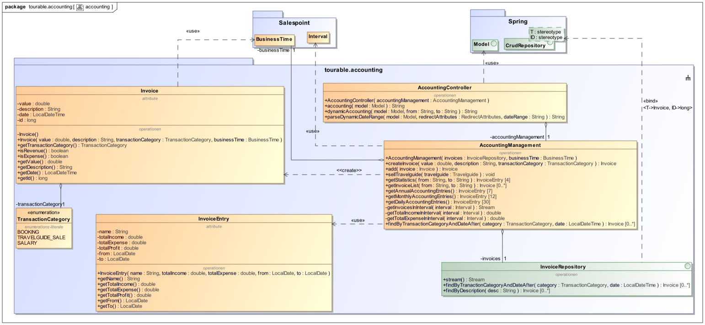

:toc: auto
:company_name: CityTours
:staff_name: staff
:boss_name: boss

[options="header"]
[cols="1,3,3,3"]
|===
|Version | Bearbeitungsdatum | Autor  | Änderungen
|1.0	 | 17.11.2019        | Pascal | Finalisierung des Dokuments
|===

= Entwicklerdokumentation

== Einführung und Ziele

=== Task Definition

Städtereisen nach London, Rom oder Kopenhagen werden immer beliebter. Der Reiseveranstalter __{company_name}__ will sich in diesem Marktsegment etablieren und unterbreitet seinen Kunden individuelle Angebote. Der Kunde kann sich seine ganz persönliche Reise zusammenstellen. +
Zunächst versuchen die Mitarbeiter im Reisebüro, die Wünsche des Kunden zu analysieren, um ihm das für ihn passende Angebot zu erstellen. Dabei werden folgende Angaben erfasst:

- Zielort
- Art der Unterkunft (einfach, Standard, gehobener Standard, Luxus)
- Lage der Unterkunft (Stadtgebiet zentral, Stadtgebiet Rand, Umland)
- Wunschtermin und Reisedauer (von ... bis ...)

Mit diesen Angaben kann nun ein Angebot erstellt werden. Dazu werden alle aufgrund der Kundenwünsche möglichen Unterkünfte aus dem Datenbestand herausgesucht und die Verfügbarkeit für die gewünschte Reisedauer geprüft (Bei einer Unterkunft kann Abreise eines Kunden und Anreise eines anderen auf den gleichen Tag fallen). Wenn es keine „Treffer“ gibt, muss ein neuer Vorschlag unterbreitet werden, wobei entweder der Termin oder die Art der Unterkunft abzuändern ist. Ansonsten kann der Kunde eine Unterkunft auswählen, sofern mehrere zur Verfügung stehen. Wenn sich der Kunde für die Reise entschieden hat, werden seine Personendaten (Name, Adresse, Email, Tel.Nr.) aufgenommen (bzw. anhand der Kundennummer übertragen, falls der Kunde schon erfasst ist) und eine Buchungsbestätigung erstellt. Die Buchung ist verbindlich, kann jedoch nachträglich storniert werden. Dabei fallen bis eine Woche vor Reisebeginn Stornierungsgebühren in Höhe von 30% des Reisepreises an, von da ab ist der volle Reisepreis zu entrichten. Die Bezahlung der Reise erfolgt entweder bar oder per Überweisung bis spätestens drei Tage vor Reiseantritt. Falls diese Frist überschritten wird, ist eine Mahnung zu versenden und wenn bei Reiseantritt immernoch nicht gezahlt ist, ist die Unterkunft wieder freizugeben und  in der Buchung zu vermerken, dass die Reise nicht gezahlt wurde. +
Unabhängig von der Arbeit mit dem Kunden müssen auch andere, verwaltungstechnische Aufgaben gelöst werden, für die normalerweise der Chef von __{company_name}__ persönlich verantwortlich ist. Neue Unterkünfte (Bild, Beschreibung, Lage, Stadt, Ausstattung (Art der Unterkunft), Preis, Zimmer-/Bettenanzahl, Vermittlungsgebühr/Provision in %) sind in die Datei aufzunehmen. Daneben bemüht sich der Veranstalter, stets weitere Städte als Reiseziel anzubieten. +
Außerdem obliegt dem Chef die Tages-, Monats- und Jahresabrechnung (Einnahmen und Ausgaben), die Personalverwaltung(Registrieren neuer Mitarbeiter inkl. anlegen neuer Benuzerkonten, bearbeiten und löschen, wobei bei den Mitarbeitern folgende Daten erforderlich sind: Name, Adresse, Email(gleichzeitig Benutzerkennung), Passwort und Gehalt) und die Pflege des Kundenstammes (bearbeiten der Kundendaten, auch von Mitarbeitern möglich). Wenn ein Kunde länger als drei Jahre keine Reise bei __{company_name}__ gebucht hat, soll er aus der Datenbank gelöscht werden (Auf Knopfdruck alle zu löschenden Kunden löschen oder automatisch). +
Um sozusagen ein zweites Standbein aufzubauen, hat __{company_name}__ einen weiteren Geschäftsbereich übernommen. Seit kurzem kann man in den Filialen zu den angebotenen Reisezielen Stadtführer ausdem CityGuide-Verlag erwerben. Der Verkauf (nur ein Buch pro Kaufvorgang kaufbar, Bezahlung bar und direkt bei Kauf) bzw. die Verwaltung der Bücher (Daten: Name, Stadt, Preis) soll ebenfalls über die Software erledigt werden, aber die Abrechung soll unabhängig von der Buchung sein. Eine Lagerverwaltung für die Bücher ist dabei nicht notwendig.

Entwickeln Sie eine Software, die sowohl die Mitarbeiter der __{company_name}__-Filialen als auch den Chef von __{company_name}__ bei ihren jeweiligen Aufgaben unterstützt. 

=== Qualitätsziele

Sicherheit:
Die Sicherheit sagt aus, zu welchem Grad das System seine Informationen und Daten vor anderen Personen und Systemen beschützt.

Benutzerfreundlichkeit:
Die Benutzerfreundlichkeit sagt aus, zu welchem Grad das System in der Lage ist, seinen Nutzern zu ermöglichen, Aufgaben schnell, einfach und präzise auszuführen.

Wartbarkeit:
Die Wartbarkeit sagt aus, zu welchem Grad das System modifizierbar ist, sodass es verbessert, korrigiert oder an Veränderungen der Umgebung und Anforderungen angepasst werden kann.

1 = nicht wichtig ... 5 = sehr wichtig

[options="header", cols="3h, ^1, ^1, ^1, ^1, ^1"]
|===
|Qualitätsziel          |1  |2  |3  |4  |5
|Sicherheit             |   |   |   |x  |
|Benutzerfreundlichkeit |   |   |   |x  |
|Wartbarkeit            |   |   |   |   |x
|===

== Randbedingungen

=== Hardware-Vorgaben
Folgende Hardwarekomponenten werden für die Nutzung der Software benötigt:

* Server
* Computer
* Tastatur
* Maus

=== Software-Vorgaben
Folgende Software wird für die Nutzung der Software benötigt:

* Java-Installation
** Java 11 (oder neuer)
* einer der folgenden Webbrowser:
** Mozilla Firefox 70.0 (oder neuer)
** Google Chrome 78.0.3904.70 (oder neuer)

=== Produktnutzung
* das Produkt wird von den Mitarbeitern und dem Chef des Reiseveranstalters __{company_name}__ genutzt. Dabei soll es den Mitarbeitern und dem Chef bei der Buchung von Reisen, dem Verkauf von Reiseführern und der Verwaltung des Unternehmens unterstützen
* die Software läuft auf einem Server von __{company_name}__ und ist öffentlich aus dem Internet erreichbar (24/7). Die Mitarbeiter und der Chef können sich mit ihren Nutzerkonten anmelden, um rollenspezifische Funktionen freizuschalten. Ein unauthentifizierter Benutzer kann sich vom Chef registrieren lassen.
* die Software wird optimiert für die Darstellung und Nutzung in:
- Google Chrome 78.0.3904.70
- Mozilla Firefox 70.0
* die Nutzer des Systems umfassen die Mitarbeiter (__{staff_name}__), die Reisen buchen, Reiseführer verkaufen und Kunden verwalten, und dem Chef (__{boss_name}__), der zusätzlich das Personalmanagement und die Abrechnungen verwaltet.
* die Nutzer der Software haben nicht notwendigerweise einen technischen Hintergrund oder technisches Know-How.
* die Software muss nicht technisch gewartet werden.
* alle Daten werden persistent in einer Datenbank auf dem Server von __{company_name}__ gespeichert und können ausschließlich über die Software verwendet werden

== Kontextabgrenzung

[[context_diagram]]

== Lösungsstrategie
=== Erfüllung der Qualitätsziele
[options="header"]
|=== 
|Qualitätsziel |Lösungsansatz

|Sicherheit
a|
* *Vertraulichkeit* Die Anwendung muss sicherstellen, dass jeder Nutzer nur auf die für ihr authorisierten Daten zugreifen kann. Dies wird über die Kombination von _Spring Security_ und _Thymeleaf_ umgesetzt.
* *Integrität* Die Anwendung muss sicherstellen, dass keine nichtauthorisierte Veränderung von Anwendungsdaten stattfindet. Dies wird über die Implementierung von _Spring Security_ realisiert.
* *Verantwortlichkeit* Anwendungsaktionen sollen eindeutig zu handelnden Nutzern zugeordnet werden können.
|Benutzerfreundlichkeit
a|
* *Lernbarkeit* Der Umgang mit dem System soll leicht erlernbar und verstehbar sein. Dies soll durch Wahrung der Eindeutigkeit von Systemkomponenten und Interaktionen gewährleistet werden.
* *Umgang mit Fehlern* Die Anwendung muss den Nutzer vor dem Verursachen von Fehlern schützen. Der Nutzer soll nicht dazu in der Lage sein, das System in einen ungültigen Zustand zu überführen. Dafür müssen alle Eingaben in das System geprüft werden.
* *Interface design* Das Interface der Anwendung muss funktional, aber gleichzeitig auch ästhetisch ansprechend sein, um eine zufriedenstellende Arbeit mit dem System zu gewährleisten.
* *Accessability* Die Anwendung soll von Nutzern mit unterschiedlichen Charakteristiken genutzt werden können. Dies kann z.B durch die Nutzung größerer Schriftarten und angemessenen Farbkontrasten erreicht werden.
|Wartbarkeit
a|
* *Modularität* Die Anwendung besteht aus einzelnen Komponenten, sodass Änderungen einer Komponente geringe Auswirkungen auf andere Komponenten haben
* *Wiederverwendbarkeit* Einzelne Komponenten des Systems sollen von anderen Komponenten genutzt werden können
* *Modifizierbarkeit* Die Anwendungskomponenten sollen bearbeitet und erweitert werden können, ohne Fehler oder Qualitätsverluste zu induzieren.
|===

=== Softwarearchitektur

[[top_level_diagram]]

[[client_server_model]]

=== Entwurfsentscheidungen

==== Verwendete Muster
* Spring Model-View-Controller

==== Persistenz

Wir verwenden *Hibernate annotation based mapping* um Java-Klassen auf Datenbankobjekte zu mappen. Dabei verwenden wir *H2* als Datenbank.

==== Benutzeroberfläche

[[user_interface]]
image::models/design/images/UserInterface_diagram.svg[user_interface, title="User-Interface. Die blauen Boxen stellen ein HTML-Template dar. Die weißen Boxen repräsentieren Buttons, die zum wechseln zwischen den Templates genutzt werden."]

==== Verwendung externer Frameworks

[options="header", cols="1,3,3"]
|===
|Externe Klasse
|Pfad der externen Klasse
|Verwendet von (Klasse der eigenen Anwendung)

|MimetypesFileTypeMap
|javax.activation.MimetypesFileTypeMap
a|
* tourable.accommodation.AccommodationController

|HttpSession
|javax.servlet.http.HttpSession
a|
* tourable.booking.BookingController

|||

|SalespointSecurityConfiguration
|org.salespointframework.SalespointSecurityConfiguration
a|
* tourable.Tourable

|RecordingMailSender
|org.salespointframework.support.RecordingMailSender
a|
* tourable.booking.BookingManagement

|BusinessTime
|org.salespointframework.time.BusinessTime
a|
* tourable.accounting.Invoice
* tourable.accounting.AccountingManagement
* tourable.booking.Booking
* tourable.booking.BookingController 
* tourable.booking.BookingManagement
* tourable.accommodation.AccommodationManagement
* tourable.user.UserManagement
* tourable.customer.Customer
* tourable.customer.CustomerManagement

|Interval
|org.salespointframework.time.Interval
a|
* tourable.accounting.AccountingManagement
* tourable.booking.Booking
* tourable.booking.BookingController
* tourable.booking.BookingManagement
* tourable.accommodation.AccommodationManagement

|Role
|org.salespointframework.useraccount.Role
a|
* tourable.user.UserManagement

|Password
|org.salespointframework.useraccount.Password.UnencryptedPassword
a|
* tourable.user.UserManagement

|UserAccount
|org.salespointframework.useraccount.UserAccount
a|
* tourable.user.UserManagement

|UserAccountManager
|org.salespointframework.useraccount.UserAccountManager
a|
* tourable.user.UserManagement

|||
|LocaleContextHolder
|org.springframework.context.i18n.LocaleContextHolder
a|
* tourable.booking.BookingManagement
* tourable.booking.PDFGenerator

|Sort
|org.springframework.data.domain.Sort
a|
* tourable.booking.BookingManagement
* tourable.booking.BookingRepository
* tourable.accommodation.AccommodationRepository
* tourable.accommodation.AccommodationManagement
* tourable.city.CityRepository
* tourable.city.CityManagement
* tourable.travelguide.TravelguideRepository
* tourable.travelguide.TravelguideManagement

|CrudRepository
|org.springframework.data.repository.CrudRepository
a|
* tourable.accounting.InvoiceRepository 
* tourable.accommodation.AccommodationRepository
* tourable.booking.BookingRepository
* tourable.customer.CustomerRepository
* tourable.travelguide.TravelguideRepository
* tourable.user.UserRepository
* tourable.city.CityRepository

|HttpHeaders
|org.springframework.http.HttpHeaders
a|
* tourable.booking.BookingController

|HttpStatus
|org.springframework.http.HttpStatus
a|
* tourable.booking.BookingController

|MediaType
|org.springframework.http.MediaType
a|
* tourable.booking.BookingController

|ResponseEntity
|org.springframework.http.ResponseEntity
a|
* tourable.booking.BookingController

|SimpleMailMessage
|org.springframework.mail.SimpleMailMessage
a|
* tourable.booking.BookingManagement

|HttpSecurity
|org.springframework.security.config.annotation.web.builders.HttpSecurity
a|
* tourable.Tourable

|Model
|org.springframework.ui.Model
a|
* tourable.accommodation.AccommodationController
* tourable.accounting.AccountingController 
* tourable.booking.BookingController
* tourable.customer.CustomerController
* tourable.travelguide.TravelguideController
* tourable.user.UserController
* tourable.city.CityController

|BindingResult
|org.springframework.validation.BindingResult
a|
* tourable.accommodation.AccommodationController
* tourable.customer.CustomerController

|Errors
|org.springframework.validation.Errors
a|
* tourable.accommodation.CityController
* tourable.travelguide.TravelguideController

|MultipartFile
|org.springframework.web.multipart.MultipartFile
a|
* tourable.accommodation.AccommodationDataForm

|ViewControllerRegistry
|org.springframework.web.servlet.config.annotation.ViewControllerRegistry
a|
*tourable.Tourable

|WebMvcConfigurer
|org.springframework.web.servlet.config.annotation.WebMvcConfigurer
a|
*tourable.Tourable

|RedirectAttributes
|org.springframework.web.servlet.mvc.support.RedirectAttributes
a|
* tourable.accounting.AccountingController 

|||
|StandardFonts
|com.itextpdf.io.font.constants.StandardFonts
a|
* tourable.booking.PDFGenerator
|ColorConstants
|com.itextpdf.kernel.colors.ColorConstants
a|
* tourable.booking.PDFGenerator

|PdfFont
|com.itextpdf.kernel.font.PdfFont
a|
* tourable.booking.PDFGenerator

|PdfFontFactory
|com.itextpdf.kernel.font.PdfFontFactory
a|
* tourable.booking.PDFGenerator

|Rectangle
|com.itextpdf.kernel.geom.Rectangle
a|
* tourable.booking.PDFGenerator

|PdfDocument
|com.itextpdf.kernel.pdf.PdfDocument
a|
* tourable.booking.PDFGenerator

|PdfPage
|com.itextpdf.kernel.pdf.PdfPage
a|
* tourable.booking.PDFGenerator

|PdfWriter
|com.itextpdf.kernel.pdf.PdfWriter
a|
* tourable.booking.PDFGenerator

|PdfCanvas
|com.itextpdf.kernel.pdf.canvas.PdfCanvas
a|
* tourable.booking.PDFGenerator

|Canvas
|com.itextpdf.layout.Canvas
a|
* tourable.booking.PDFGenerator

|Border
|com.itextpdf.layout.borders.Border
a|
* tourable.booking.PDFGenerator

|DoubleBorder
|com.itextpdf.layout.borders.DoubleBorder
a|
* tourable.booking.PDFGenerator

|SolidBorder
|com.itextpdf.layout.borders.SolidBorder
a|
* tourable.booking.PDFGenerator

|Cell
|com.itextpdf.layout.element.Cell
a|
* tourable.booking.PDFGenerator

|Paragraph
|com.itextpdf.layout.element.Paragraph
a|
* tourable.booking.PDFGenerator

|Table
|com.itextpdf.layout.element.Table
a|
* tourable.booking.PDFGenerator

|Text
|com.itextpdf.layout.element.Text
a|
* tourable.booking.PDFGenerator

|BorderCollapsePropertyValue
|com.itextpdf.layout.property.BorderCollapsePropertyValue
a|
* tourable.booking.PDFGenerator

|TextAlignment
|com.itextpdf.layout.property.TextAlignment
a|
* tourable.booking.PDFGenerator

|===

== Bausteinsicht

=== Tourable

[[tourable]]
image::models/design/images/class_diagram/tourable.svg[tourable]

[options="header"]
|=== 
|Klasse/Enumeration |Beschreibung
|Tourable | Die zentrale Klasse die Spring Container konfiguriert und die Application laufen lässt
|TourableWebConfiguration | Konfigurationsklasse die `/login` direkt zu `login.html` routed 
|WebSecurityConifguration | Konfigurationsklasse die das Setup von grundlegender Security und login/logout Optionen handled.
|===

=== Accommodation

[[accommodation]]
image::models/design/images/class_diagram/accommodation.svg[accommodation]

[options="header"]
|=== 
|Klasse/Enumeration |Beschreibung
|Accommodation | Eine Klasse die Accommodations als Objekte realisiert
|AccommodationController | Ein Spring MVC Controller der das erstellen, edititeren und anzeigen von Accommodations handled.  
|AccommodationManager | Service Klasse die Accommodations verwaltet
|AccommodationDataForm | Eine Klasse, die den Input des Benutzers beim erstellen und editieren von Accommodations validiert
|AccommodationRepository | Eine Repository Interface die alle Instanzen von Accommodation verwaltet
|AccommodationLocation | Enumeration, welche die Location der Accommodation definiert als eines der folgenden Optionen: CITY_CENTRE, SUBURBAN, COUNTRYSIDE
|AccommodationType | Enumeration, welche den Type der Accommodation definiert als eine der folgenden Optionen: SIMPLE, STANDARD, STANDARD_PLUS, LUXURY 
|AccommodationEntry | Klasse welche zum abfragen der Accommodations anhand Preis und Datum dient beim Buchungsprozess
|AccommodationFilterDataForm | Eine Klasse die zum Filtern von Accommodations dient
|===

=== Accounting

[[accounting]]

[options="header"]
|=== 
|Klasse/Enumeration |Beschreibung
|Invoice | Eine Klasse, die einzelne Abrechnungen als Objekte realisiert.
|AccountingManagement | Die Service Klasse die Abrechnungen verwaltet.
|invoiceEntry | Eine Klasse die mehrere `Invoice` s für statistische Zwecke zusammenfasst.
|AccountingController | Ein Spring MVC Controller der für das Anzeigen von Abrechnungen als Jahres-, Monats-, Tages- und dynamischer Übersicht verantwortlich ist.
|InvoiceRepository | Ein Repository Interface, das alle Instanzen von `Invoice` verwaltet.
|TransactionCategory | Enumeration, welche die Kategorie der Abrechnung definiert als eine der folgenden Optionen: `BOOKING`, `TRAVELGUIDE_SALE` oder `SALARY`.
|===
=== Booking

[[booking]]
image::models/design/images/class_diagram/booking.svg[booking]

[options="header"]
|=== 
|Klasse/Enumeration |Beschreibung
|Booking | Eine Klasse die Buchungen als Objekte realisiert
|BookingManagement | Service Klasse die die Buchungen verwaltet, Mahnungen verschickt und Anfragen bearbeitet und darauf die Buchung erstellt.
|BookingController | Ein Spring MVC Controller der das Erstellen, manuelle Verwalten und Anzeigen von Buchungen handelt.
|BookingRepository | Ein Repository Interface das alle Instanzen von `Booking` verwaltet.
|PDFGenerator | Eine Klasse die für eine gewählte Buchung eine Rechnung als PDF erstellt.
|BookingStatus | Enumeration, welche den Status des `Booking` definiert als eines der folgenden optionen: `OPEN`, `PAID`, `CANCELLED`, `UNPAID`.
|PaymentMethod | Enumeration, welche die Zahlungsmethode des `Booking` definiert als eines der folgenden optionen: `CASH`, `TRANSFER`
|CustomerSearchForm | Eine Klasse die den Input des Benutzers in der `CustomerSearchForm` validiert und den Suchparameter weiter gibt.
|AccommodationSearchForm | Eine Klasse die den Input des Benutzers in der `AccommodationSearchForm` validiert und die Suchparameter weiter gibt
|===

=== City

[[city]]

[options="header"]
|=== 
|Klasse/Enumeration  |Beschreibung
|City                |Klasse, die Städte als Objekte realisiert
|CityController      |Ein Spring MVC Controller, um Anfragen zum Erstellen, Aktualisieren und Löschen von Städten entgegenzunehmen und die Liste aller Städte anzuzeigen
|CityManagement      |Serviceklasse, um die Städte zu verwalten
|CityDataForm        |Klasse, um die Eingaben von Mitarbeitern bei der Erstellung und Bearbeitung von Städten zu validieren
|CityRepository      |Interface, das die Stadt-Instanzen des Systems verwaltet
|===

=== Customer

[[customer]]

[options="header"]
|=== 
|Klasse/Enumeration |Beschreibung
|Customer           |Klasse, um den Kunden zu beschreiben
|CustomerController |Ein Spring MVC Controller, um Anfragen zum Registrieren, Aktualisieren und Löschen von Kunden entgegenzunehmen und die Liste aller Kunden anzuzeigen
|CustomerManagement |Backend Klasse, um die Kunden zu verwalten
|CustomerDataForm   |Klasse, um die Eingaben von Mitarbeitern auf der Registrierungsseite für einen Kunden zu validieren
|CustomerRepository |Interface, um die registrierten Kunden zu speichern und zu verwalten
|===

=== Travelguide

[[travelguide]]

[options="header"]
|=== 
|Klasse/Enumeration    |Beschreibung
|Travelguide           |Klasse, die Reiseführer als Objekte realisiert.
|TravelguideController |Ein Spring MVC Controller, der Anfragen zum Erstellen, Anzeigen, Bearbeiten und Verkaufen von Reiseführern bearbeitet.
|TravelguideManagement |Serviceklasse, die Reiseführer verwaltet.
|TravelguideDataForm   |Klasse, um die Eingaben von Nutzern beim Erstellen und Bearbeiten von Reiseführern zu validieren
|TravelguideRepository |Interface, das die Reiseführer-Instanzen des Systems verwaltet
|===

=== User

[[user]]

[options="header"]
|=== 
|Klasse/Enumeration |Beschreibung
|User|Benutzerdefinierte Klasse um die Salespoint-UserAccounts um Gehalt, Telefonnummer und Adresse zu erweitern
|UserController|Ein Spring MVC Controller zur Bearbeitung und Registrierung von Usern
|UserManagement|Klasse zur Userverwaltung
|UserRepository|Eine Repository-Schnittstelle zum Verwalten von Userinstanzen
|UserDataForm|Eine Klasse zur Überprüfung der Benutzereingabe des Registrierungsformulars
|===

=== Rückverfolgbarkeit zwischen Analyse- und Entwurfsmodell

[options="header"]
|===
|Klasse/Enumeration (Analysemodell) |Klasse/Enumeration (Entwurfsmodell) |Anwendung
| Accommodation | accommodation.Accommodation|
| AccommodationManager | accommodation.AccommodationManager|
| AccommodationLocation | accommodation.AccommodationLocation|
| AccommodationType | accommodation.AccommodationType|
| Booking | booking.Booking|
| BookingManager | booking.BookingManagement|
| BookingStatus | booking.BookingStatus|
| Customer | customer.Customer|
| CustomerManager | customer.CustomerManagement|
| Invoice |accounting.Invoice | 
| InvoiceManager |accounting.AccountingManagement |
|TransactionCategory |accounting.TransactionCategory |
|TransactionType |accounting.Invoice.isExpense() / .isRevenue() |Methodenparameter
| PaymentMethod | booking.PaymentMethod|
| Role |Salespoint.Role |
| Tourable |Tourable |
| Travelguide |travelguide.Travelguide |
| TravelguideManager |travelguide.TravelguideManagement |
| User |user.User |
| UserManager |user.UserManagement |
|===

== Laufzeitsicht
* Komponentenbezogene Sequenzdiagramme, welche darstellen, wie die Anwendung mit externen Frameworks (zB. Salespoint, Spring) interagiert.

=== Accommodation

[[accommodation]]

=== Accounting

[[accounting]]

=== Booking

[[booking]]
image::models/design/images/sequence_diagram/booking_create_sequence.svg[bookting, title=" Buchung erstellen"]

=== Customer

[[customer]]

=== Travelguide

[[travelguide]]

=== User

[[user]]

== Technische Schulden
* noch keine
