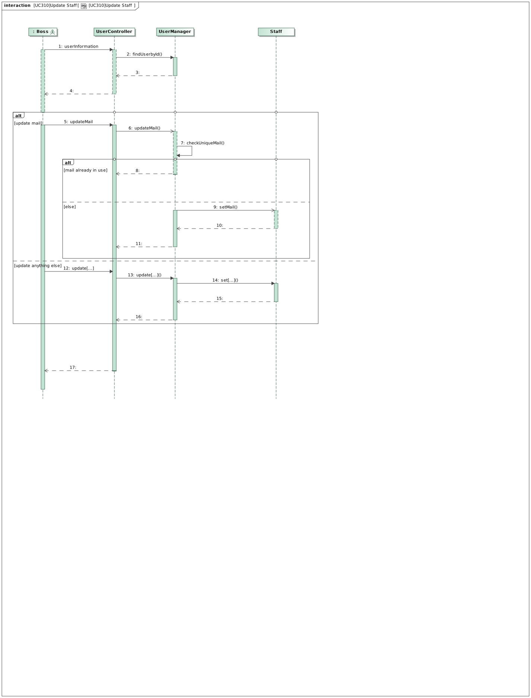
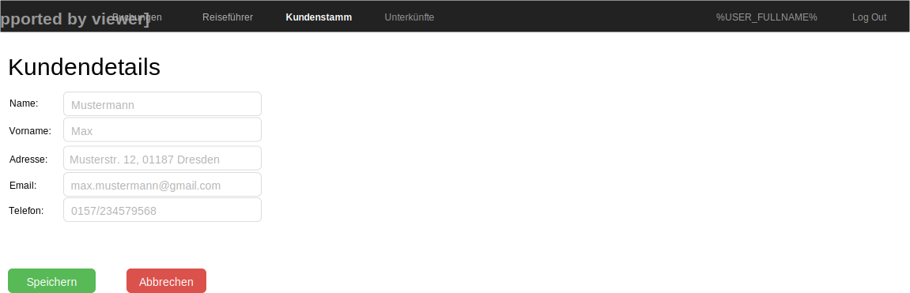

= Pflichtenheft
:toc: auto
:project_name: Reiseveranstalter
:company_name: CityTours
:product_name: tourable
:staff_name: staff
:boss_name: boss

== __{project_name}__

[options="header"]
[cols="1, 1, 1, 1, 4"]
|===
|Version
|Status
|Bearbeitungsdatum
|Autoren(en)
|Vermerk

|0.1
|In Arbeit
|10.10.2019
|Autor
|Initiale Version

|0.2
|In Arbeit
|27.10.2019
|Pascal
|Grundlegende Informationen, Use-Cases und funktionale Anforderungen hinzugefügt

|0.3
|In Arbeit
|29.10.2019
|Pascal
|Funktionale Anforderungen aktualisiert und erweitert

|0.4
|In Arbeit
|30.10.2019
|Florian
|Aufgabenstellung und Zielsetzung aktualisiert

|0.5
|vorläufig final
|03.11.2019
|Pascal
|Einbinden fehlender Dateien, Cleanup

|0.6
|final
|08.11.2019
|Pascal
|Korrektur

|0.7
|final
|14.01.2020
|Florian
|Entfernen von <<F316>> auf Kundenwunsch
|===

== Zusammenfassung
Dieses Pflichtenheft dokumentiert die Eigenschaften und den Nutzungskontext der von  __{company_name}__  gewünschten Anwendung. Dabei geht es auf die Beschreibung der Kundenwünsche sowie die Zielsetzung der beschriebenen Anwendung ein.

Außerdem umfasst dieses Dokument die Anforderungsspezifikation der __{product_name}__-Software, die vom Reiseveranstalter __{company_name}__ genutzt wird, um Buchungen zu erstellen und Reiseführer zu verkaufen, sowie den Kundenstamm, die Mitarbeiter und das Accounting der Firma zu verwalten. 
Im Pflichtenheft wird zudem auf verschiedene Anwendungsfälle eingegangen, aus denen die Anforderungen an die Anwendung abgeleitet werden. Dabei spielen sowohl funktionale als auch nicht-funktionale Anforderungen eine Rolle.
Danach wird eine mögliche graphische Umsetzung der Anwendung vorgestellt. Anschließend wird mithilfe von Diagrammen die Klassen-Architektur erläutert und einzelne Klassen und Enumerationen vorgestellt. Zuletzt wird mit Sequenzdiagrammen aufgezeigt, welche möglichen Akzeptanztestfälle sich für die Anwendung ergeben.
Das Pflichtenheft dient als Grundlage für das weitere Vorgehen im Praktikum.

== Aufgabenstellung und Zielsetzung

Städtereisen nach London, Rom oder Kopenhagen werden immer beliebter. Der Reiseveranstalter __{company_name}__ will sich in diesem Marktsegment etablieren und unterbreitet seinen Kunden individuelle Angebote. Der Kunde kann sich seine ganz persönliche Reise zusammenstellen. +
Zunächst versuchen die Mitarbeiter im Reisebüro, die Wünsche des Kunden zu analysieren, um ihm das für ihn passende Angebot zu erstellen. Dabei werden folgende Angaben erfasst:

- Zielort
- Art der Unterkunft (einfach, Standard, gehobener Standard, Luxus)
- Lage der Unterkunft (Stadtgebiet zentral, Stadtgebiet Rand, Umland)
- Wunschtermin und Reisedauer (von ... bis ...)

Mit diesen Angaben kann nun ein Angebot erstellt werden. Dazu werden alle aufgrund der Kundenwünsche möglichen Unterkünfte aus dem Datenbestand herausgesucht und die Verfügbarkeit für die gewünschte Reisedauer geprüft (Bei einer Unterkunft kann Abreise eines Kunden und Anreise eines anderen auf den gleichen Tag fallen). Wenn es keine „Treffer“ gibt, muss ein neuer Vorschlag unterbreitet werden, wobei entweder der Termin oder die Art der Unterkunft abzuändern ist. Ansonsten kann der Kunde eine Unterkunft auswählen, sofern mehrere zur Verfügung stehen. Wenn sich der Kunde für die Reise entschieden hat, werden seine Personendaten (Name, Adresse, Email, Tel.Nr.) aufgenommen (bzw. anhand der Kundennummer übertragen, falls der Kunde schon erfasst ist) und eine Buchungsbestätigung erstellt. Die Buchung ist verbindlich, kann jedoch nachträglich storniert werden. Dabei fallen bis eine Woche vor Reisebeginn Stornierungsgebühren in Höhe von 30% des Reisepreises an, von da ab ist der volle Reisepreis zu entrichten. Die Bezahlung der Reise erfolgt entweder bar oder per Überweisung bis spätestens drei Tage vor Reiseantritt. Falls diese Frist überschritten wird, ist eine Mahnung zu versenden und wenn bei Reiseantritt immernoch nicht gezahlt ist, ist die Unterkunft wieder freizugeben und  in der Buchung zu vermerken, dass die Reise nicht gezahlt wurde. +
Unabhängig von der Arbeit mit dem Kunden müssen auch andere, verwaltungstechnische Aufgaben gelöst werden, für die normalerweise der Chef von __{company_name}__ persönlich verantwortlich ist. Neue Unterkünfte (Bild, Beschreibung, Lage, Stadt, Ausstattung (Art der Unterkunft), Preis, Zimmer-/Bettenanzahl, Vermittlungsgebühr/Provision in %) sind in die Datei aufzunehmen. Daneben bemüht sich der Veranstalter, stets weitere Städte als Reiseziel anzubieten. +
Außerdem obliegt dem Chef die Tages-, Monats- und Jahresabrechnung (Einnahmen und Ausgaben), die Personalverwaltung(Registrieren neuer Mitarbeiter inkl. anlegen neuer Benuzerkonten, bearbeiten und löschen, wobei bei den Mitarbeitern folgende Daten erforderlich sind: Name, Adresse, Email(gleichzeitig Benutzerkennung), Passwort und Gehalt) und die Pflege des Kundenstammes (bearbeiten der Kundendaten, auch von Mitarbeitern möglich). Wenn ein Kunde länger als drei Jahre keine Reise bei __{company_name}__ gebucht hat, soll er aus der Datenbank gelöscht werden (Auf Knopfdruck alle zu löschenden Kunden löschen oder automatisch). +
Um sozusagen ein zweites Standbein aufzubauen, hat __{company_name}__ einen weiteren Geschäftsbereich übernommen. Seit kurzem kann man in den Filialen zu den angebotenen Reisezielen Stadtführer ausdem CityGuide-Verlag erwerben. Der Verkauf (nur ein Buch pro Kaufvorgang kaufbar, Bezahlung bar und direkt bei Kauf) bzw. die Verwaltung der Bücher (Daten: Name, Stadt, Preis) soll ebenfalls über die Software erledigt werden, aber die Abrechung soll unabhängig von der Buchung sein. Eine Lagerverwaltung für die Bücher ist dabei nicht notwendig.

Entwickeln Sie eine Software, die sowohl die Mitarbeiter der __{company_name}__-Filialen als auch den Chef von __{company_name}__ bei ihren jeweiligen Aufgaben unterstützt. 

== Produktnutzung
* das Produkt wird von den Mitarbeitern und dem Chef des Reiseveranstalters __{company_name}__ genutzt. Dabei soll es den Mitarbeitern und dem Chef bei der Buchung von Reisen, dem Verkauf von Reiseführern und der Verwaltung des Unternehmens unterstützen
* die Software läuft auf einem Server von __{company_name}__ und ist öffentlich aus dem Intranet erreichbar (24/7). Die Mitarbeiter und der Chef können sich mit ihren Nutzerkonten anmelden, um rollenspezifische Funktionen freizuschalten.
* die Software wird optimiert für die Darstellung und Nutzung in:
- Google Chrome 78.0.3904.70
- Mozilla Firefox 70.0
* die Nutzer des Systems umfassen die Mitarbeiter (__{staff_name}__), die Reisen buchen, Reiseführer verkaufen und Kunden verwalten, und dem Chef (__{boss_name}__), der zusätzlich das Personalmanagement und die Abrechnungen verwaltet.
* die Nutzer der Software haben nicht notwendigerweise einen technischen Hintergrund oder technisches Know-How.
* die Software muss nicht technisch gewartet werden.
* alle Daten werden persistent in einer Datenbank auf dem Server von __{company_name}__ gespeichert und können ausschließlich über die Software verwendet werden

== Interessensgruppen (Stakeholders)
[options="header", cols="2, ^1, 4, 4"]
|===
|Name
|Priorität
|Beschreibung
|Ziele

|{company_name}
|5
|der primäre Projekt-Client
a|
- möglichst einfache und intuitive Benutzung
- Prozessautomatisierung
- gute Accessability

|{staff_name}
|4
|primäre Nutzer der Software
a|
- gute UX
- einfache, intuitive Benutzbarkeit

|{boss_name}
|4
|Chef, administrierende und verwaltende Aufgaben
a|
- Überblick über Systemdaten
- Prozessmanagement
- Accounting

|Entwickler
|3
|Personen, die die Software entwickeln
a|
- einfache Erweiterbarkeit, modularer Aufbau
- kein Wartungsaufwand
- gute Debug-Möglichkeiten
- gute Testabdeckung
|===

== Systemgrenze und Top-Level-Architektur

=== Kontextdiagramm

[[context_diagram]]

=== Top-Level-Architektur

[[top_level_diagram]]

== Anwendungsfälle

=== Akteure

[options="header"]
[cols="1,4"]
|===
|Name
|Beschreibung

|user
|repräsentiert eine Person, die mit dem System interagiert

|{staff_name}
|repräsentiert einen authentifizierten Benutzer (Mitarbeiter)

|{boss_name}
|repäsentiert einen Chef
|===

=== Überblick Anwendungsfalldiagramm

[[use_case_diagram]]

=== Anwendungsfallbeschreibungen

[cols="1h,3"]
[[UC010]]
|===
|ID                         |<<UC010>>
|Name                       |Login/Logout
|Beschreibung               |Der __{staff_name}__ soll die Möglichkeit haben, sich im System anzumelden, um Zugriff auf relevante Funktionen zu bekommen.
|Akteure                    |{staff_name}
|Trigger                    a|
__Login__: Der __{staff_name}__ möchte sich einloggen, um die Funktionen des Systems nutzen zu können.

__Logout__: Der __{staff_name}__ möchte sich ausloggen, um anderen Mitarbeitern die Möglichkeit zu geben, sich im Browser anzumelden.
|Voraussetzung(en)          a|
__Login__: Der __{staff_name}__ ist noch nicht authentifiziert.

__Logout__: Der __{staff_name}__ ist authentifiziert.
|Ablauf                     a|
__Login__:

1. Der __{staff_name}__ klickt auf "Log In" in der Navigationsleiste.
2. Der __{staff_name}__ gibt seine Mailadresse und sein Passwort ein.
3. Der __{staff_name}__ klickt auf "Anmelden".

__Logout__:

1. Der __{staff_name}__ klickt auf "Ausloggen" in der Navigationsleiste.
2. Der __{staff_name}__ ist nicht mehr authentifiziert und wird auf die Startseite weitergeleitet.
|Extensions                 |-
|Funktionale Anforderungen  |<<F010>>
|===

[cols="1h,3"]
[[UC110]]
|===
|ID                         |<<UC110>>
|Name                       |Travel Guide Sale
|Beschreibung               |Der __{staff_name}__ soll die Möglichkeit haben, Reiseführer zu verkaufen.
|Akteure                    |{staff_name}
|Trigger                    |Der __{staff_name}__ klickt auf "Reiseführer" in der Navigationsleiste.
|Voraussetzung(en)          a|

* Der __{staff_name}__ ist authentifiziert.

|Ablauf                     a|

1. Der __{staff_name}__ klickt auf "Reiseführer" in der Navigationsleiste und anschließend auf "Reiseführer verkaufen".
2. Der __{staff_name}__ wählt einen Reiseführer über ein Suchfeld aus, in das er die Stadt des Reiseführers eintippt. Er bekommt daraufhin eine Liste aller Reiseführer in dieser Stadt angezeigt, aus der er einen Reiseführer per Klick selektieren kann.
3. Der __{staff_name}__ bestätigt den Kauf mit einem Klick auf "Kaufen". Eine Rechnung wird der Datenbank hinzugefügt.

|Extensions                 |-
|Funktionale Anforderungen  |<<F210>>
|===

[cols="1h,3"]
[[UC120]]
|===
|ID                         |<<UC120>>
|Name                       |View Booking
|Beschreibung               |Der __{staff_name}__ soll die Möglichkeit haben, die Liste aller Buchungen anzuzeigen und diese nach bestimmten Kriterien zu filtern
|Akteure                    |{staff_name}
|Trigger                    |Der __{staff_name}__ klickt auf "Buchungen" in der Navigationsleiste.
|Voraussetzung(en)          a|

* Der __{staff_name}__ ist authentifiziert.

|Ablauf                     a|

1. Der __{staff_name}__ klickt auf "Buchungen" in der Navigationsleiste.
2. Der __{staff_name}__ sieht alle Buchungen in einer Liste nach Datum absteigend sortiert.
3. Der __{staff_name}__ kann Buchungen durch ein Dropdown nach dem Buchungsstatus filtern.
4. Der __{staff_name}__ kann durch einen Klick auf eine beliebige Buchung in der Liste Details zu der jeweiligen Buchung anzeigen lassen. Diese Details beinhalten:

 * Buchungsnummer
 * Buchungsdatum
 * Buchungsstatus
 * Zahlungsmittel
 * Unterkunfteigenschaften
 * Start- und Enddatum
 * Kundendetails

|Extensions                 |-
|Funktionale Anforderungen  |<<F200>>, <<F202>>, <<F203>>, <<F204>>
|===

[cols="1h,3"]
[[UC130]]
|===
|ID                         |<<UC130>>
|Name                       |Create Booking
|Beschreibung               |Der __{staff_name}__ soll die Möglichkeit haben, eine neue Buchung zu erstellen.
|Akteure                    |{staff_name}
|Trigger                    |Der __{staff_name}__ klickt auf "Buchungen" in der Navigationsleiste.
|Voraussetzung(en)          a|

* Der __{staff_name}__ ist authentifiziert.

|Ablauf                     a|

1. Der __{staff_name}__ klickt auf "Buchungen" in der Navigationsleiste.
2. Der __{staff_name}__ klickt auf den Button "Neue Buchung erstellen".
3. Der __{staff_name}__ erzeugt eine Liste möglicher Unterkünfte über einen Dialog, der folgende Daten beachtet:

 * Zielort (Textfeld)
 * Art der Unterkunft (Dropdown)
 * Lage der Unterkunft (Dropdown)
 * Start- und Enddatum der Reise

4. Der __{staff_name}__ wählt aus der Liste eine passende Unterkunft aus. Sollte es nicht möglich sein, eine passende Unterkunft zu finden, so sollen auch Ergebnisse mit abgeändertem Reisebeginn (gleiche Reisedauer), abgeänderter Unterkunftsart oder abgeänderter Unterkunftslage angeboten werden.
5. Der __{staff_name}__ wählt den Kunden über ein Suchfeld aus, in das er den Namen des Kunden eintippt.
6. Der __{staff_name}__ kann bei Bedarf einen Reiseführer zu der Buchung hinzubuchen. Dort kann er einen Reiseführer aus der Liste auswählen. Die Rechnung des Reiseführers wird extra in die Datenbank geschrieben.
7. Der __{staff_name}__ validiert alle Eingaben auf der Übersichtsseite.
8. Der __{staff_name}__ bestätigt die Buchung mit einem Klick auf "Buchen".

|Extensions                 |-
|Funktionale Anforderungen  |<<F200>>, <<F201>>
|===

[[uc_130]]

'''

[cols="1h,3"]
[[UC140]]
|===
|ID                         |<<UC140>>
|Name                       |Update Booking Status
|Beschreibung               |Der __{staff_name}__ soll die Möglichkeit haben, den Status einer Buchung zu verändern.
|Akteure                    |{staff_name}
|Trigger                    |Der __{staff_name}__ klickt auf eine Buchung in der Liste der Buchungen.
|Voraussetzung(en)          a|

* Der __{staff_name}__ ist authentifiziert.
* Der __{staff_name}__ ist auf der Buchungsübersichtsseite, auf der alle Buchungen aufgelistet werden.

|Ablauf                     a|

1. Der __{staff_name}__ klickt auf eine Buchung in der Liste der Buchungen. Die Buchungsdetails werden angezeigt.
2. Auf der Details-Seite gibt es mehrere Buttons, um den Buchungsstatus zu verändern:

 * ein Button "Buchung als bezahlt markieren", der eine Buchung als bezahlt markiert. Dabei wird eine Abrechnung in die Datenbank aufgenommen. Dabei soll eine Buchung nur als bezahlt markiert werden können, wenn sie den Zahlungstyp *TRANSFER* besitzt, da eine bar bezahlte Buchung direkt bezahlt ist.
 * ein Button "Buchung stornieren", der eine Buchung samt aller dabei ablaufenden Prozesse (Stornierungskosten) storniert.
 * ein Button "Buchung löschen", der die Buchung ohne weitere Kosten storniert (bspw bei falscher Eingabe durch den __{staff_name}__), wenn in der Buchung vorher nichts verändert wurde und die Buchung maximal ein Tag alt ist.

|Extensions                 |-
|Funktionale Anforderungen  |<<F200>>, <<F205>>, <<F208>>, <<F209>>
|===

[cols="1h,3"]
[[UC150]]
|===
|ID                         |<<UC150>>
|Name                       |Cancel Booking
|Beschreibung               |Der __{staff_name}__ soll die Möglichkeit haben, eine Buchung zu stornieren.
|Akteure                    |{staff_name}
|Trigger                    |Der __{staff_name}__ klickt auf eine Buchung in der Liste der Buchungen.
|Voraussetzung(en)          a|

* Der __{staff_name}__ ist authentifiziert.
* Der __{staff_name}__ ist auf der Buchungsübersichtsseite, auf der alle Buchungen aufgelistet werden.

|Ablauf                     a|

1. Der __{staff_name}__ klickt auf eine Buchung in der Liste der Buchungen. Die Buchungsdetails werden angezeigt.
2. Der __{staff_name}__ storniert eine Buchung mit einem Klick auf "Buchung stornieren".
3. Der __{staff_name}__ klick auf "Bestätigen".

|Extensions                 |-
|Funktionale Anforderungen  |<<F200>>, <<F205>>
|===

[cols="1h,3"]
[[UC160]]
|===
|ID                         |<<UC160>>
|Name                       |Delete Booking
|Beschreibung               |Der __{staff_name}__ soll die Möglichkeit haben, eine Buchung zu löschen, wenn er etwas falsch eingegeben hat.
|Akteure                    |{staff_name}
|Trigger                    |Der __{staff_name}__ klickt auf eine Buchung in der Liste der Buchungen.
|Voraussetzung(en)          a|

* Der __{staff_name}__ ist authentifiziert.
* Der __{staff_name}__ ist auf der Buchungsübersichtsseite, auf der alle Buchungen aufgelistet werden.

|Ablauf                     a|

1. Der __{staff_name}__ klickt auf eine Buchung in der Liste der Buchungen. Die Buchungsdetails werden angezeigt.
2. Der __{staff_name}__ löscht eine Buchung mit einem Klick auf "Buchung löschen".
3. Der __{staff_name}__ klickt auf "Ja", bei dem Bestätigungsdialog, ob er die Buchung wirklich löschen will.

|Extensions                 |-
|Funktionale Anforderungen  |<<F200>>, <<F208>>
|===

[cols="1h,3"]
[[UC210]]
|===
|ID                         |<<UC210>>
|Name                       |Create Customer
|Beschreibung               |Der __{staff_name}__ soll die Möglichkeit haben, eine neuen Kunden in die Datenbank einzufügen.
|Akteure                    |{staff_name}
|Trigger                    |Der __{staff_name}__ klickt auf "Kundenstamm" in der Navigationsleiste.
|Voraussetzung(en)          a|

* Der __{staff_name}__ ist authentifiziert.
* Der __{staff_name}__ sieht die Seite Kundenstamm oder die Seite Anfrage.

|Ablauf                     a|

1. Der __{staff_name}__ klickt auf "Neuer Kunde".
2. Der __{staff_name}__ gibt Name, Adresse, Mailadresse und Telefonnummer des Kunden ein.
3. Das System verifiziert Einzigartigkeit der Mailadresse.
4. Wenn Einzigartigkeit gegeben: Kunde wird erstellt mit den eingegebenen Daten, eine Kundennummer wird automatisch generiert. Sonst: Eine Meldung erfolgt, dass diese Email schon einem Kunden gehört.

|Extensions                 |-
|Funktionale Anforderungen  |<<F102>>, <<F100>>, <<F020>>
|===

[[uc_210]]

'''

[cols="1h,3"]
[[UC220]]
|===
|ID                         |<<UC220>>
|Name                       |View Customer List
|Beschreibung               |Der __{staff_name}__ soll die Möglichkeit haben, die Kundenliste zu sehen.
|Akteure                    |{staff_name}
|Trigger                    |Der __{staff_name}__ klickt auf "Kundenstamm" in der Navigationsleiste.
|Voraussetzung(en)          a|

* Der __{staff_name}__ ist authentifiziert.

|Ablauf                     a|

1. Der __{staff_name}__ klickt auf "Kundenstamm" in der Navigationsleiste.
2. Der __{staff_name}__ sieht eine Tabelle aller Kunden mit Name, Vorname, Kundennummer.
3. Der __{staff_name}__ kann Kundendetails durch einen Klick auf einen bestimmten Kunden anzeigen.

|Extensions                 |-
|Funktionale Anforderungen  |<<F103>>
|===

[[uc_220]]
image::models/analysis/images/UC220_ViewCustomerList.svg[uc_220, title="Sequenzdiagramm UC220"]

'''

[cols="1h,3"]
[[UC230]]
|===
|ID                         |<<UC230>>
|Name                       |Update Customer Information
|Beschreibung               |Der __{staff_name}__ soll die Möglichkeit haben, die Kundendaten zu editieren.
|Akteure                    |{staff_name}
|Trigger                    |Der __{staff_name}__ klickt auf "Bearbeiten" in der Detailansicht des zu bearbeitenden Kunden.
|Voraussetzung(en)          a|

* Der __{staff_name}__ ist authentifiziert und sieht die Detailseite des zu bearbeitenden Kunden.

|Ablauf                     a|

1. Der __{staff_name}__ klickt auf den zu bearbeitenden Kunden im Kundenstamm.
2. Das System zeigt dem __{staff_name}__ die zu dem Kunden momentan gespeicherten Daten an: Name, Adresse, Mailadresse, Kundennummer, abgeschlossene /offene Buchungen.
3. Der __{staff_name}__ klickt auf Kundendaten bearbeiten.
4. Der __{staff_name}__ wird auf eine Seite weitergeleitet, wo er die Kundendaten in Textfeldern ändern kann.
5. Der __{staff_name}__ klickt auf "Speichern".
6. Das System verifiziert bei Änderung der Email die Einzigartigkeit der Mailadresse.
7. Wenn Einzigartigkeit gegeben, oder Mailadresse nicht verändert: Die Daten des Kunden werden aktualisiert. Sonst: Eine Meldung erfolgt, dass diese Mailadresse schon einem Kunden gehört.
|Extensions                 |-
|Funktionale Anforderungen  |<<F104>>, <<F105>>, <<F100>>, <<F020>>, <<F203>>
|===

[[uc_230]]
image::models/analysis/images/UC230_UpdateCustomerInformation.svg[uc_230, title="Sequenzdiagramm UC230"]

'''

[cols="1h,3"]
[[UC310]]
|===
|ID                         |<<UC310>>
|Name                       |Staff Management
|Beschreibung               |Der __{boss_name}__ soll die Möglichkeit haben, ein neues Mitarbeiterkonto anzulegen, die Liste aller Konten angezeigt zu bekommen, Konten zu bearbeiten und zu löschen.
|Akteure                    |{boss_name}
|Trigger                    a|
__create__: Der __{boss_name}__ möchte ein neues Konto für seinen Mitarbeiter anlegen, damit dieser die Funktionen des Systems nutzen kann.

__read__: Der __{boss_name}__ möchte sich die Liste aller Mitarbeiterkonten anschauen.

__update__: Der __{boss_name}__ möchte Kontodaten des Mitarbeiters aktualisieren.

__delete__: Der __{boss_name}__ möchte ein Mitarbeiterkonto löschen.
|Voraussetzung(en)          a|
Der Nutzer ist als Boss authentifiziert und hat die Rolle "__{boss_name}__".
|Ablauf                     a|
__create__:

1. Der __{boss_name}__ klickt auf "Mitarbeiter verwalten" in seiner Navigationsleiste, daraufhin klickt er auf "Neuen Mitarbeiter anlegen".
2. Der __{boss_name}__ gibt alle notwendigen Daten des Mitarbeiters ein.
3. Der __{boss_name}__ klickt auf "Mitarbeiter anlegen".

__read__:

1. Der __{boss_name}__ klickt auf "Mitarbeiter verwalten". Er bekommt die Liste aller Mitarbeiter angezeigt.

__update__:

1. Der __{boss_name}__ klickt auf einen Mitarbeiter in der Liste der Mitarbeiter. Details zum Mitarbeiter werden auf einer neuen Seite angezeigt.
2. Der __{boss_name}__ klickt auf "Mitarbeiterdaten ändern". Er wird auf eine neue Seite weitergeleitet, auf der er Änderungen an den Daten vornehmen kann.
3. Der __{boss_name}__ klickt auf "Änderungen speichern". Bei Änderung der Mailadresse wird diese auf Einzigartigkeit geprüft.

__delete__: 

1. Der __{boss_name}__ klickt auf einen Mitarbeiter in der Liste der Mitarbeiter.
2. Der __{boss_name}__ Klickt auf "Mitarbeiter löschen".
3. Der __{boss_name}__ bestätigt die Abfrage, ob das Konto wirklich gelöscht werden soll.

|Extensions                 |-
|Funktionale Anforderungen  |<<F301>>, <<F302>>, <<F303>>, <<F304>>, <<K001>>
|===

[[uc_310_1]]

[[uc_310_2]]

[[uc_310_3]]

[[uc_310_4]]

'''

[cols="1h,3"]
[[UC320]]
|===
|ID                         |<<UC320>>
|Name                       |Accomodation Management
|Beschreibung               |Der __{boss_name}__ soll die Möglichkeit haben, eine neue Unterkunft anzulegen, die Liste aller Unterkünfte angezeigt zu bekommen, Unterkünfte zu bearbeiten und zu löschen.
|Akteure                    |{boss_name}
|Trigger                    a|
__create__: Der __{boss_name}__ möchte eine neue Unterkunft anlegen.

__read__: Der __{boss_name}__ möchte sich die Liste aller Unterkünfte anschauen.

__update__: Der __{boss_name}__ möchte die Daten der Unterkunft aktualisieren.

__delete__: Der __{boss_name}__ möchte eine Unterkunft löschen.
|Voraussetzung(en)          a|
Der Nutzer ist als Boss authentifiziert und hat die Rolle "__{boss_name}__".
|Ablauf                     a|
__create__:

1. Der __{boss_name}__ klickt auf "Unterkünfte" in seiner Navigationsleiste. Daraufhin klickt er auf "Neue Unterkunft anlegen"
2. Der __{boss_name}__ gibt alle notwendigen Daten der Unterkunft ein.
3. Der __{boss_name}__ klickt auf "Unterkunft anlegen".

__read__:

1. Der __{boss_name}__ klickt auf "Unterkünfte" in der Navigationsleiste. Er bekommt die Liste aller Unterkünfte angezeigt.

__update__:

1. Der __{boss_name}__ klickt auf eine Unterkunft in der Liste der Unterkünfte. Details zu der Unterkunft werden auf einer neuen Seite angezeigt. 
2. Der __{boss_name}__ klickt auf "Unterkunft bearbeiten". Er wird auf eine neue Seite weitergeleitet, auf der er die Unterkunftsdaten bearbeiten kann.
3. Der __{boss_name}__ aktualisiert die zu ändernden Daten.
4. Der __{boss_name}__ klickt auf "Änderungen speichern".

__delete__: 

1. Der __{boss_name}__ klickt auf eine Unterkunft in der Unterkunftsliste.
2. Der __{boss_name}__ klickt auf "Unterkunft löschen".
3. Der __{boss_name}__ bestätigt die Abfrage, ob die Unterkunft wirklich gelöscht werden soll.

|Extensions                 |-
|Funktionale Anforderungen  |<<F310>>, <<F311>>, <<F312>>, <<F314>>, <<F315>>
|===

[cols="1h,3"]
[[UC330]]
|===
|ID                         |<<UC330>>
|Name                       |Travel Guide Management
|Beschreibung               |Der __{boss_name}__ soll die Möglichkeit haben, einen neuen Reiseführer anzulegen, die Liste aller Reisführer angezeigt zu bekommen,Daten eines Reiseführers zu bearbeiten und zu löschen.
|Akteure                    |{boss_name}
|Trigger                    a|
__create__: Der __{boss_name}__ möchte einen neuen Reiseführer anlegen.

__read__: Der __{boss_name}__ möchte sich die Liste aller Reiseführer anschauen.

__update__: Der __{boss_name}__ möchte die Daten eines Reiseführers aktualisieren.

__delete__: Der __{boss_name}__ möchte einen Reiseführer löschen.
|Voraussetzung(en)          a|
Der Nutzer ist als Boss authentifiziert und hat die Rolle "__{boss_name}__".
|Ablauf                     a|
__create__:

1. Der __{boss_name}__ klickt auf "Reiseführer" in seiner Navigationsleiste. Dort klickt er auf "Neuen Reiseführer anlegen"
2. Der __{boss_name}__ gibt alle notwendigen Daten des Reiseführers ein.
3. Der __{boss_name}__ klickt auf "Reiseführer anlegen".

__read__:

1. Der __{boss_name}__ klickt auf "Reiseführer" in der Navigationsleiste. Dort wird eine Übersicht über alle Reiseführer angezeigt.

__update__:

1. Der __{boss_name}__ klickt auf einen Reiseführer in der Reiseführerliste. Die Details zu einem Reiseführer werden angezeigt.
2. Der __{boss_name}__ klickt auf "Reiseführer bearbeiten".
3. Der __{boss_name}__ aktualisiert die zu ändernden Daten.
4. Der __{boss_name}__ klickt auf "Änderungen speichern".

__delete__: 

1. Der __{boss_name}__ klickt auf einen Reiseführer in der Reiseführerliste.
2. Der __{boss_name}__ klickt auf "Reiseführer löschen".
3. Der __{boss_name}__ bestätigt die Abfrage, ob die Reiseführer wirklich gelöscht werden soll.

|Extensions                 |-
|Funktionale Anforderungen  |<<F320>>, <<F321>>, <<F322>>, <<F323>>, <<F324>>, <<F325>>
|===

[cols="1h,3"]
[[UC340]]
|===
|ID                         |<<UC340>>
|Name                       |Clean Database
|Beschreibung               |Kunden, die seit mehr als 3 Jahren keine Reise mehr gebucht haben, werden automatisch aus der Dankenbank gelöscht.
|Akteure                    |
|Trigger                    a|
Beim Aufrufen des Kundenstamms wird automatisch überprüft, ob es inaktive Kunden gibt.
|Voraussetzung(en)          a|
Der Nutzer ist als Boss bzw. Mitarbeiter authentifiziert und hat die Rolle "__{boss_name}__" btw. "__{staff_name}__".
|Ablauf                     a|
Der __{boss_name}__ klickt auf "Kundenstamm" in seiner Navigationsleiste. Es wird automatisch überprüft, ob es inaktive Kunden gibt. Falls ja, werden sie gelöscht.
|Extensions                 |-
|Funktionale Anforderungen  |<<F305>>
|===

[[uc_340]]

'''

[cols="1h,3"]
[[UC350]]
|===
|ID                         |<<UC350>>
|Name                       |Create Dynamic Accounting
|Beschreibung               |Der __{boss_name}__ soll die Möglichkeit haben, eine dynamische Abrechnung sich anzeigen zu lassen, wo er einen beliebigen Zeitraum wählen kann.
|Akteure                    |{boss_name}
|Trigger                    a|
Der __{boss_name}__ klickt auf "Abrechnungen" in seiner Navigationsleiste.
|Voraussetzung(en)          a|
Der Nutzer ist authentifiziert und hat die Rolle "__{boss_name}__"
|Ablauf                     a|
1. Der __{boss_name}__ klickt auf "Abrechnungen" in der Navigationsbar.
2. Er öffnet den Tab "dynamische Abrechnung".
3. Er wählt ein Anfangsdatum und ein Enddatum. 
4. Ihm wird die Gesamtliste an Transaktionen des gewählten Zeitraums angezeigt.
|Extensions                 |-
|Funktionale Anforderungen  |<<F331>>
|===

[[uc_350]]

'''

[cols="1h,3"]
[[UC360]]
|===
|ID                         |<<UC360>>
|Name                       |Create Daily Accounting
|Beschreibung               |Der __{boss_name}__ soll die Möglichkeit haben, eine Tagesabrechnung sich anzeigen zu lassen.
|Akteure                    |{boss_name}
|Trigger                    a|
Der __{boss_name}__ klickt auf "Abrechnungen" in seiner Navigationsleiste.
|Voraussetzung(en)          a|
Der Nutzer ist authentifiziert und hat die Rolle "__{boss_name}__"
|Ablauf                     a|
1. Der __{boss_name}__ klickt auf "Abrechnungen" in der Navigationsbar.
2. Er öffnet den Tab "tägliche Abrechnung".
3. Er sieht eine Liste der vergangenen Tage mit dem jeweiligen Gesamtumsatz.
4. Bei einem Klick auf einen Tag werden ihm alle Abrechnungen des jeweiligen Tages angezeigt.
|Extensions                 |-
|Funktionale Anforderungen  |<<F332>>
|===

[cols="1h,3"]
[[UC370]]
|===
|ID                         |<<UC370>>
|Name                       |Create Monthly Accounting
|Beschreibung               |Der __{boss_name}__ soll die Möglichkeit haben, eine Monatsabrechnung sich anzeigen zu lassen.
|Akteure                    |{boss_name}
|Trigger                    a|
Der __{boss_name}__ klickt auf "Abrechnungen" in seiner Navigationsleiste.
|Voraussetzung(en)          a|
Der Nutzer ist authentifiziert und hat die Rolle "__{boss_name}__"
|Ablauf                     a|
1. Der __{boss_name}__ klickt auf Abrechnungen in der Navigationsbar.
2. Er öffnet den Tab "monatliche Abrechnung".
3. Er sieht eine Liste der vergangenen Monate mit dem jeweiligen Gesamtumsatz.
4. Bei einem Klick auf einen Monat werden ihm alle Abrechnungen des jeweiligen Monats angezeigt.
|Extensions                 |-
|Funktionale Anforderungen  |<<F333>>
|===

[cols="1h,3"]
[[UC380]]
|===
|ID                         |<<UC380>>
|Name                       |Create Annual Accounting
|Beschreibung               |Der __{boss_name}__ soll die Möglichkeit haben, eine Jahresabbuchung sich anzeigen zu lassen.
|Akteure                    |{boss_name}
|Trigger                    a|
Der __{boss_name}__ klickt auf "Abrechnungen" in seiner Navigationsleiste.
|Voraussetzung(en)          a|
Der Nutzer ist authentifiziert und hat die Rolle "__{boss_name}__"
|Ablauf                     a|
1. Der __{boss_name}__ klickt auf "Abrechnungen" in der Navigationsbar.
2. Er öffnet den Tab "jährliche Abrechnung".
3. Er sieht eine Liste der vergangenen Jahre mit dem jeweiligen Gesamtumsatz.
4. Bei einem Klick auf ein Jahr werden im alle Abrechnungen des jeweiligen Jahres angezeigt.
|Extensions                 |-
|Funktionale Anforderungen  |<<F334>>
|===

== Funktionale Anforderungen

=== Muss-Kriterien
[options="header", cols="2h, 1, 3, 12"]
|===
|ID
|Version
|Name
|Beschreibung

|[[F010]]<<F010>>
|v0.1
|Authentifizierung
a|
Das System ist liegt in einem privaten Bereich, der nur authentifizierten Benutzern zugänglich ist. Ein registierter Benutzer kann sich mit folgenden Daten anmelden:

* Mail-Adresse
* Passwort

|[[F020]]<<F020>>
|v0.1
|Validierung
a|
Das System ist dazu in der Lage, eingegebene Nutzerdaten und Kundendaten zu validieren. Dabei soll die Einzigartigkeit des Email-Adresse garantiert werden. Der Nutzer soll über eventuelle Fehler bei der Validierung informiert werden.

|[[F030]]<<F030>>
|v0.1
|Registrierung
a|
Das System ist dazu in der Lage, dem __{boss_name}__ die Möglichkeit zu geben, neue Benutzer zu erstellen. Die eingegebenen Nutzerdaten sollen validiert werden (<<F020>>).

|[[F100]]<<F100>>
|v0.1
|Kunden
a|
Das System ist dazu in der Lage, Informationen über Kunden persistent in einer Datenbank zu speichern.

|[[F101]]<<F101>>
|v0.1
|Löschung von Kunden
a|
Das System ist dazu in der Lage, die Daten inaktiver Kunden (Kunden, die seit 3 Jahren keine Reise mehr gebucht haben) automatisch aus der Datenbank zu löschen.

|[[F102]]<<F102>>
|v0.1
|Erstellung von Kunden
a|
Das System ist dazu in der Lage, dem __{staff_name}__ die Möglichkeit zu geben, neue Kunden in die Datenbank aufzunehmen mit folgenden Eigenschaften:

* Name
* Adresse
* Mail-Adresse
* Telefonnummer
* automatisch erzeugte Kundennummer

|[[F103]]<<F103>>
|v0.1
|Kunden anzeigen
a|
Das System ist dazu in der Lage, dem __{staff_name}__ die Möglichkeit zu geben, die Liste an Kunden anzuzeigen.

|[[F104]]<<F104>>
|v0.1
|Kundendetails anzeigen
a|
Das System ist dazu in der Lage, dem __{staff_name}__ die Möglichkeit zu geben, Informationen zu einzelnen Kunden anzuzeigen. Dies beinhaltet:

* Name
* Adresse
* Mail-Adresse
* Telefonnummer
* Kundennummer
* abgeschlossene und noch offene Buchungen

|[[F105]]<<F105>>
|v0.1
|Kundendetails ändern
a|
Das System ist dazu in der Lage, dem __{staff_name}__ die Möglichkeit zu geben, die Eigenschaften von Kunden zu verändern. Die Änderung folgender Information soll möglich sein:

* Name
* Adresse
* Mail-Adresse
* Telefonnummer

|[[F200]]<<F200>>
|v0.1
|Buchungen
a|
Das System ist dazu in der Lage, Informationen über Buchungen persistent in einer Datenbank zu speichern.

|[[F201]]<<F201>>
|v0.1
|Buchung erstellen
a|
Das System ist dazu in der Lage, dem __{staff_name}__ die Möglichkeit zu geben, Buchungen zu erstellen. Diese enthält die folgenden Daten:

* Unterkunft
* Start- und Enddatum
* Kundennummer
* Zahlungmittel
* Status

Der Status der Buchung wird mit *OPEN* initialisiert, wenn der Kunde die Buchung mittels Überweisung bezahlt. Zahlt der Kunde direkt bar, wird der Status mit *PAID* initialisiert. Weiterhin soll es bei der Buchung eine Möglichkeit geben, direkt einen Reiseführer zur Reise dazuzubuchen (<<F210>>).

|[[F202]]<<F202>>
|v0.1
|Buchungen anzeigen
a|
Das System ist dazu in der Lage, dem __{staff_name}__ die Möglichkeit zu geben, eine Liste aller Buchungen anzuzeigen.

|[[F203]]<<F203>>
|v0.1
|Buchungen filtern
a|
Das System ist dazu in der Lage, dem __{staff_name}__ die Möglichkeit zu geben, Buchungen nach ausgewählten Kriterien zu filtern. Diese beinhalten:

* Buchungsstatus
* Kundennummer

|[[F204]]<<F204>>
|v0.1
|Buchungsdetails anzeigen
a|
Das System ist dazu in der Lage, dem __{staff_name}__ die Möglichkeit zu geben, Informationen zu einzelnen Buchungen anzuzeigen. Diese beinhalten:

* Unterkunft
* Start- und Enddatum
* Kundennummer
* Zahlungmittel
* Status

|[[F205]]<<F205>>
|v0.1
|Buchung stornieren
a|
Das System ist dazu in der Lage, dem __{staff_name}__ die Möglichkeit zu geben, Buchungen zu stornieren. Dabei wird der Buchungsstatus auf *CANCELLED* gesetzt und automatisch eine Stornierungsgebühr für den Kunden berechnet (30% des Reisepreises bis 1 Woche vor Reiseantritt, danach voller Reisepreis)

|[[F206]]<<F206>>
|v0.1
|Mahnungen versenden
a|
Das System ist dazu inder Lage automatisch eine Mahnung per Mail an alle Kunden zu versenden, die eine Reise gebucht haben, die in den nächsten 3 Tagen beginnt, diese allerdings noch nicht bezahlt haben. Diese Mahnung enthält Informationen zur Buchung in Textform:

* Kundennummer
* Buchung

|[[F207]]<<F207>>
|v0.1
|Buchung freigeben
a|
Das System soll dazu in der Lage sein, Buchungen, die bereits begonnen haben, aber noch nicht bezahlt wurden, automatisch in den Zustand *UNPAID* zu überführen und die gebuchte Unterkunft wieder freizugeben.

|[[F208]]<<F208>>
|v0.1
|Buchung löschen
a|
Das System ist dazu in der Lage, dem __{staff_name}__ die Möglichkeit zu geben, Buchungen aus dem System zu entfernen, ohne dass dafür weitere Konsequenzen (Stornierungsgebühren) für den Kunden entstehen.

|[[F209]]<<F209>>
|v0.1
|Buchung bezahlen
a|
Das System ist dazu in der Lage, dem __{staff_name}__ die Möglichkeit zu geben, Buchungen als bezahlt zu markieren. Dabei wird eine Abrechnung in die Datenbank aufgenommen. (<<F330>>)

|[[F210]]<<F210>>
|v0.1
|Reiseführer verkaufen
a|
Das System ist dazu in der Lage, dem __{staff_name}__ die Möglichkeit zu geben, Reiseführer zu verkaufen. Der Reiseführer kann nur bar bezahlt werden, weshalb das System direkt eine Abrechnung mit dem Buchpreis in die Datenbank aufnimmt.

|[[F300]]<<F300>>
|v0.1
|Mitarbeiter
a|
Das System ist dazu in der Lage, Informationen zum __{staff_name}__ persistent in einer Datenbank zu speichern.

|[[F301]]<<F301>>
|v0.1
|Mitarbeiter (__{staff_name}__) hinzufügen
a|
Das System ist dazu in der Lage, dem __{boss_name}__ die Möglichkeit zu geben, neue Mitarbeiter zu erstellen. (<<F030>>) Diese können sich dann im System anmelden (<<F010>>). Mitarbeiter haben folgende Eigenschaften:

* Name
* Adresse
* Gehalt
* Email
* Passwort

|[[F302]]<<F302>>
|v0.1
|Mitarbeiter (__{staff_name}__) anzeigen
a|
Das System ist dazu in der Lage, dem __{boss_name}__ die Möglichkeit zu geben, die Liste an Mitarbeitern anzuzeigen.

|[[F303]]<<F303>>
|v0.1
|Mitarbeiterdetails anzeigen
a|
Das System ist dazu in der Lage, dem __{boss_name}__ die Möglichkeit zu geben, Informationen über Mitarbeiter anzuzeigen. Diese beinhalten:

* Name
* Adresse
* Gehalt
* Email

|[[F304]]<<F304>>
|v0.1
|Mitarbeiter (__{staff_name}__) bearbeiten
a|
Das System ist dazu in der Lage, dem __{boss_name}__ die Möglichkeit zu geben, Informationen von Mitarbeitern zu bearbeiten. Diese beinhalten:

* Name
* Adresse
* Gehalt
* Email
* Passwort

|[[F305]]<<F305>>
|v0.1
|Mitarbeiter (__{staff_name}__) löschen
a|
Das System ist dazu in der Lage, dem __{boss_name}__ die Möglichkeit zu geben, Mitarbeiter aus der Datenbank zu löschen. Damit ist es für diese Mitarbeiter nicht mehr möglich, sich im System anzumelden (<<F010>>).

|[[F310]]<<F310>>
|v0.1
|Unterkünfte
a|
Das System ist dazu in der Lage, Informationen zu Unterkünften persistent in einer Datenbank zu speichern.

|[[F311]]<<F311>>
|v0.7
|Unterkunft erstellen
a|
Das System ist dazu in der Lage, dem __{boss_name}__ die Möglichkeit zu geben, neue Unterkünfte zu erstellen. Dies beinhalten die folgenden Informationen:

* Name
* Ort
* Art der Unterkunft
* Lage der Unterkunft
* Bild
* Beschreibung (Freitext)
* Preis
* Zimmer- und Bettenzahl
* Vermittlungsgebühr/Provision [%]

*_Veraltet:_* [.line-through]#Die eingegebenen Daten sollen validiert werden (<<F316>>).#

|[[F312]]<<F312>>
|v0.1
|Unterkünfte anzeigen
a|
Das System ist dazu in der Lage, dem __{staff_name}__ die Möglichkeit zu geben, die Liste aller Unterkünfte anzuzeigen.

|[[F313]]<<F313>>
|v0.1
|Unterkunft filtern
a|
Das System ist dazu in der Lage, dem __{staff_name}__ die Möglichkeit zu geben, Unterkünfte nach verschiedenen Kriterien zu filtern. Diese beinhalten:

* Ort
* Art der Unterkunft
* Lage der Unterkunft

|[[F314]]<<F314>>
|v0.1
|Unterkunft bearbeiten
a|
Das System ist dazu in der Lage, dem __{boss_name}__ die Möglichkeit zu geben, Eigenschaften von Unterkünften zu bearbeiten. Diese beinhalten:

* Name
* Ort
* Art der Unterkunft
* Lage der Unterkunft
* Bild
* Beschreibung
* Preis
* Zimmer- und Bettenzahl
* Vermittlungsgebühr/Provision

|[[F315]]<<F315>>
|v0.1
|Unterkunft löschen
a|
Das System ist dazu in der Lage, dem __{boss_name}__ die Möglichkeit zu geben, Unterkünfte aus der Datenbank zu löschen.

|[.line-through]#[[F316]]<<F316>>#
|v0.7
|*_Veraltet:_* [.line-through]#Unterkunft validieren#
a|
*_Veraltet:_* [.line-through]#Das System ist dazu in der Lage, die Eigenschaften neuer Unterkünfte zu validieren. Dabei soll die Eindeutigkeit des Unterkunftsnamens gewährleistet werden. Eventuelle Fehler bei der Validierung sollen dem Nutzer angezeigt werden.#

|[[F320]]<<F320>>
|v0.1
|Reiseführer
a|
Das System ist dazu in der Lage, Informationen zu Reiseführern persistent in einer Datenbank zu speichern.

|[[F321]]<<F321>>
|v0.1
|Reiseführer hinzufügen
a|
Das System ist dazu in der Lage, dem __{boss_name}__ die Möglichkeit zu geben, neue Reiseführer in das System einzupflegen. Diese haben die folgenden Eigenschaften:

* Name
* Stadt
* Preis

|[[F322]]<<F322>>
|v0.1
|Reiseführer anzeigen
a|
Das System ist dazu in der Lage, dem __{staff_name}__ die Möglichkeit zu geben, die Liste der Reiseführer im System anzuzeigen.

|[[F323]]<<F323>>
|v0.1
|Reiseführerdetails anzeigen
a|
Das System ist dazu in der Lage, dem __{staff_name}__ die Möglichkeit zu geben, die Eigenschaften von Reiseführern anzuzeigen.

|[[F324]]<<F324>>
|v0.1
|Reiseführer filtern
a|
Das System ist dazu in der Lage, dem __{staff_name}__ die Möglichkeit zu geben, Reiseführer nach Stadt zu filtern.

|[[F325]]<<F325>>
|v0.1
|Reiseführer bearbeiten
a|
Das System ist dazu in der Lage, dem __{boss_name}__ die Möglichkeit zu geben, Eigenschaften von Reiseführern zu bearbeiten. Dazu zählen die folgenden Informationen:

* Name
* Stadt
* Preis

|[[F326]]<<F326>>
|v0.1
|Reiseführer löschen
a|
Das System ist dazu in der Lage, dem __{boss_name}__ die Möglichkeit zu geben, Reiseführer aus der Datenbank zu löschen.

|[[F330]]<<F330>>
|v0.1
|Rechnungen
a|
Das System ist dazu in der Lage, Abrechnungen zu Reisen und Reiseführern persistent in einer Datenbank zu speichern.

|[[F331]]<<F331>>
|v0.1
|dynamische Abrechnung erstellen
a|
Das System ist dazu in der Lage, dem __{boss_name}__ die Möglichkeit zu geben, alle Abrechnungen in einem angebenen Zeitraum (Start-, Enddatum) anzuzeigen, sowie eine Zusammenfassung (Differenz gesamt, ...) anzuzeigen.

|[[F332]]<<F332>>
|v0.1
|tägliche Abrechnung
a|
Das System ist dazu in der Lage, dem __{boss_name}__ die Möglichkeit zu geben, unter Nutzung der dynamischen Abrechnung (<<F331>>) eine Übersicht der Abrechnungen am aktuellen Tag und aller zurückliegenden Tage, an denen Transaktionen stattgefunden haben, anzuzeigen.

|[[F333]]<<F333>>
|v0.1
|monatliche Abrechnung
a|
Das System ist dazu in der Lage, dem __{boss_name}__ die Möglichkeit zu geben, unter Nutzung der dynamischen Abrechnung (<<F331>>) eine Übersicht der Abrechnungen im laufenden Monat und aller zurückliegenden Monate, in denen Transaktionen stattgefunden haben, anzuzeigen.

|[[F334]]<<F334>>
|v0.1
|jährliche Abrechnung
a|
Das System ist dazu in der Lage, dem __{boss_name}__ die Möglichkeit zu geben, unter Nutzung der dynamischen Abrechnung (<<F331>>) eine Übersicht der Abrechnungen im laufenden Kalendarjahr und aller zurückliegenden Kalenderjahre, in denen Transaktionen stattgefunden haben, anzuzeigen.

|===

=== Kann-Kriterien
[options="header", cols="2h, 1, 3, 12"]
|===
|ID
|Version
|Name
|Beschreibung

|[[K001]]<<K001>>
|v0.1
|manuelles Löschen von Kundendaten
a|
Das System ist kann dazu in der Lage sein, dem __{boss_name}__ die Möglichkeit zu geben, Kundendaten manuell aus der Datenbank zu löschen.
|===

== Nicht-Funktionale Anforderungen

=== Qualitätsziele

1 = nicht wichtig ... 5 = sehr wichtig

[options="header", cols="3h, ^1, ^1, ^1, ^1, ^1"]
|===
|Qualitätsziel          |1  |2  |3  |4  |5
|Sicherheit             |   |   |   |x  |
|Benutzerfreundlichkeit |   |   |   |x  |
|Wartbarkeit            |   |   |   |   |x
|===

=== Konkrete Nicht-Funktionale Anforderungen

[options="header", cols="1h, 1, 2, 4"]
|===
|ID
|Version
|Name
|Beschreibung

|[[NF010]]<<NF010>>
|v0.1
|Uptime
|Das System soll mindestens 99,5% der Zeit online erreichbar sein.

|[[NF020]]<<NF020>>
|v0.1
|Passwortspeicherung
|Das System soll die Passwörter der Nutzer nur in gehashter Form speichern, um Passwortdiebstahl zu verhindern.
|===

== GUI Prototyp

=== Überblick: Dialoglandkarte
[[dialogmap]]
image::gui_prototype/Dialogmap.svg[dialogmap, title="Dialoglandkarte"]

=== Dialogbeschreibung

[[home_unauthorized]]
image::gui_prototype/Start_unauthorized.svg[home_unauthorized, title="Startseite, nicht authorisierter Nutzer"]

Maskenelemente:

* Button in der Navigationsleiste zum Wechsel auf die Loginseite

'''

[[login]]

Maskenelemente:

* Textfeld zum Eintragen der Email
* Textfeld zum Eintragen des Passworts
* Checkbox zum Speichern der Anmeldedaten
* Button zum Anmelden

'''

[[home_authorized]]
image::gui_prototype/Start.svg[home_authorized, title="Startseite, authorisierter Nutzer"]

Maskenelemente:

* Hauptnavigationspunkte in der Navigationsleiste, jeweils Buttons zum Wechsel auf die jeweiligen Unterseiten
* Textfeld in der Navigationsleiste, welches den derzeitigen Benutzer kennzeichnet
* Button in der Navigationsleiste zum Ausloggen

'''

[[bookings]]

Maskenelemente:

* Aktuelle Seite in der Navigationsleiste markiert
* Button, um eine neue Buchung zu erstellen
* Tabelle, die alle Buchungen enthält, mit den folgenden Eigenschaften zur schnellen Übersicht:
** Datum der Buchung
** Buchungsinformationen
** Kundennummer des Kunden, der die Reise gebucht hat
** Buchungsstatus, farblich markiert

'''

[[booking_details]]

Maskenelemente:

* Labels, die Informationen zur Buchung, zur Unterkunft und zum Kunden darstellen
* Button, um die Buchung als bezahlt zu markieren (sofern die Buchung noch nicht bezahlt ist)
* Button, um die Buchung zu stornieren (sofern noch nicht storniert)
* Button, um die Buchung zu löschen

'''

[[new_booking]]
image::gui_prototype/Buchung_erstellen.svg[new_booking, title="Neue Buchung erstellen"]

Maskenelemente:

* Textfeld für Zielort der Reise
* Dropdowns für Art und Lage der Unterkunft
* Datumswähler für Wahl des Start- und Enddatums
* Button zum Aktualisieren der Liste
* Liste aller Unterkünfte, die den vorherigen Angaben genügen (sowie ggf. mit Änderungen bei der Buchungsart und Reisezeitraum, jeweils mit Anmerkung)

[%hardbreaks]
* Textfeld für Kundennummer bzw. Kundenname
* Button zum Aktualisieren der Liste
* Liste aller Kunden, die den vorherigen Angaben genügen (entweder Kundennummer oder Name)

[%hardbreaks]
* Checkbox zum Hinzufügen eines Reiseführerverkaufs, bei Nichtselektion sind die folgenden Fehler deaktiviert, ansonsten aktiviert
* Textfeld für Stückzahl
* Liste an Reiseführern vom Zielort

'''

[[validate_booking]]

Maskenelemente:

* Labels, die Informationen zur Buchung und zum Kunden anzeigen
* Button, um die Buchung zu bestätigen
* Button, um zurück zur vorherigen Seite zu gelangen

'''

[[travelguides]]
image::gui_prototype/Reiseführer.svg[travelguides, title="Übersicht über die Reiseführer (bearbeiten nur für Boss!)"]

Maskenelemente:

* Button, um Reiseführerverkauf zu starten
* Liste aller Reiseführer mit den Details
** Name
** Stadt
** Preis

'''

[[travelguide_details]]
image::gui_prototype/Reiseführerdetails.svg[travelguide_details, title="Details zu einem Reiseführer (bearbeiten nur für Boss!)"]

Maskendetails:

* Labels, die Informationen zum Reiseführer anzeigen
* Button, um Reiseführerinfos zu bearbeiten (nur, wenn als Boss angemeldet)

'''

[[travelguide_edit]]
image::gui_prototype/Reiseführer_bearbeiten.svg[travelguide_edit, title="Reiseführerdetails bearbeiten"]

Maskendetails:

* Textfelder, um Details zum Reiseführer zu ändern
* Button zum Speichern
* Button zum Abbrechen

'''

[[travelguide_sale]]
image::gui_prototype/Reiseführer_verkaufen.svg[travelguide_sale, title="Reiseführer verkaufen"]

Maskenelemente:

* Textfeld für Ort
* Textfeld für Stückzahl (noch nicht in Prototyp zu sehen)
* Button zum Aktualisieren der Liste
* Button, um Verkauf zu validieren

'''

[[travelguide_sale_validation]]
image::gui_prototype/Reiseführerverkauf_validieren.svg[travelguide_sale_validation, title="Reiseführerverkauf validieren"]

Maskenelemente:

* Labels, die Informationen zum Reiseführerverkauf anzeigen
* Button, um Verkauf abzuschließen
* Button zum Abbrechen

'''

[[customers]]

Maskenelemente:

* Button, um neuen Kunden anzulegen
* Liste alle Kunden mit folgenden Informationen:
** Kundennummer
** Name
** Vorname

'''

[[customer_details]]

Maskenelemente:

* Labels, die Informationen zum Kunden anzeigen
* Button, um Kundendaten zu bearbeiten

'''

[[customer_details_edit]]

Maskenelemente:

* Textfelder, um Kundendetails zu bearbeiten
* Button zum Speichern
* Button zum Abbrechen

'''

[[new_customer]]

Maskenelemente:

* Textfelder, um Kundeninformationen einzugeben
* Button zum Erstellen

'''

[[accommodations]]
image::gui_prototype/Unterkünfte.svg[accommodations, title="Unterkünfte anzeigen"]

Maskenelemente:

* Button, um neue Unterkunft zu erstellen (nur für Boss)
* Liste aller Unterkünfte mit folgenden Details:
** Name
** Stadt
** Art (nicht im Prototyp)
** Lage (nicht im Prototyp)

'''

[[accommodation_details]]

Maskenelemente:

* Labels, die Informationen zur Unterkunft anzeigen
* Bild, welches die Unterkunft zeigt
* Button zum Bearbeiten (nur für Boss)

'''

[[edit_accommodation_details]]

Maskenelemente:

* Textfelder, um die Informationen zu einer Unterkunft zu bearbeiten
* Dropdowns für Unterkunftsart und -lage
* Upload, um das Bild zur Unterkunft zu ändern
* Button zum Speichern
* Button zum Abbrechen

'''

[[new_accommodation]]

Maskenelemente:

* Textfelder, um die Informationen zu einer Unterkunft einzutragen
* Dropdowns für Unterkunftsart und -lage
* Upload, um das Bild zur Unterkunft hochzuladen
* Button zum Hinzufügen

'''

[[staff]]

Maskenelemente:

* Button zum Hinzufügen neuer Mitarbeiter
* Liste aller Mitarbeiter mit folgenden Informationen:
** Name
** Vorname

'''

[[staff_details]]

Maskenelemente:

* Labels, die die Informationen zu einem Mitarbeiter anzeigt (Gehalt noch nicht im Prototyp)
* Button zum Bearbeiten

'''

[[edit_staff_details]]

Maskenelemente:

* Textfelder, um die Informationen zu einem Mitarbeiter zu ändern (Gehalt noch nicht im Prototyp)
* Button zum Hinzufügen
* Button zum Abbrechen

'''

[[new_staff]]
image::gui_prototype/Mitarbeiter_hinzufügen.svg[new_staff, title="Unterkunft hinzufügen"]

Maskenelemente:

* Textfelder, um die Informationen zu einem Mitarbeiter einzutragen (Gehalt noch nicht in Prototyp)
* Button zum Hinzufügen

'''

[[accounting]]

Maskenelemente:

* Tabs für dynamische Abrechnung und jährliche, monatliche, tägliche Unterteilung
* Datumswähler für Start- und Enddatum
* Button zum Anzeigen aller Rechnungen im gewählten Zeitraum

'''

[[yearly_accounting]]
image::gui_prototype/jährliche_Abrechnung.svg[yearly_accounting, title="jährliche Abrechnungen"]

Maskenelemente:

* Tabs für dynamische Abrechnung und jährliche, monatliche, tägliche Unterteilung
* Liste aller Jahre, mit jeweiligem Gesamtumsatz
* Beim Klick auf ein Jahr -> Anzeige aller Rechnungen im gewählten Jahr

'''

[[accountingdetails]]
image::gui_prototype/Abrechnungsübersicht.svg[accountingdetails, title="Abrechnungsübersicht"]

Maskenelemente:

* Labels für Start- und Enddatum der Auswahl (zb. dynamisch oder jährlich)
* Label für Gesamtumsatz
* Tabelle mit allen Rechnungen mit Details:
** Zeitstempel der Rechnung
** Beschreibung (Verwendungszweck etc)
** Art der Rechnung
** Betrag

== Datenmodell

=== Überblick: Klassendiagramm

[[class_diagram]]

=== Klassen und Enumerationen

[options="header"]
[[classes_enumerations]]
|===
|Klasse/Enumeration |Beschreibung 
|*Accommodation*              |Repräsentation einer Unterkunft
|*AccommodationLocation*      |Kategorisiert die Lage der Unterkunft
|*AccommodationManager*       |Klasse, die Zugriff auf die Unterkünfte und Methoden zur Unterkunftsverwaltung bietet
|*AccommodationType*          |Kategorisiert die Art der Unterkunft
|*Booking*                   |Repräsentation einer Buchung
|*BookingManager*            |Klasse, die Zugriff auf alle Buchungen und Methoden zur Buchungsverwaltung bietet
|*BookingStatus*             |Repräsentiert den aktuellen Status einer Buchung +  
_OPEN_ : Die Buchung wurde vom System erstellt, aber noch nicht abgeschlossen +
_PAID_ : Die Buchung wurde bezahlt + 
_CANCELLED_ : Die Buchung wurde storniert, bevor die Reise angetreten wurde +
_UNPAID_ : Die Buchung wurde noch nicht bezahlt, nachdem die Reise angetreten wurde
|*Customer*                  |Repräsentation eines Kunden
|*CustomerManager*           |Klasse, die Zugriff auf alle Kunden und Methoden zur Kundenverwaltung bietet
|*Invoice*                   |Repräsentation einer Transaktion
|*InvoiceManager*            |Klasse, die Zugriff auf alle Transaktionen und Methoden zur Transaktionsverwaltung bietet
|*PaymentMethod*             |Kategorisiert alle möglichen Zahlungsmöglichkeiten bei einer Buchung
|*Role*                      |Kategorisiert, ob es sich um einen Mitarbeiter _(STAFF)_ oder um den Boss _(BOSS)_ handelt
|*Tourable*                  |Hauptklasse des kompletten Systems
|*TransactionCategory*       |Kategorisiert, in welcher Rubrik eine Transaktion vorgenommen wurde
|*TransactionType*           |Kategorisiert, um welche Art von Transaktion es sich handelt
|*TravelGuide*               |Repräsentation eines Reiseführers
|*TravelGuideManager*        |Klasse, die Zugriff auf alle Reiseführer und Methoden zur Reiseführerverwaltung bietet
|*User*                      |Repräsentation eines Mitarbeiters
|*UserManager*               |Klasse, die Zugriff auf alle Mitarbeiter und Methoden zur Mitarbeiterverwaltung bietet

|===

== Akzeptanztestfälle

:V: Voraussetzungen
:A: Ablauf
:R: Resultat

[cols="1h, 4"]
|===
|ID          |<<AT010>>
|Use Case    |<<UC010>>
|{V}        a| Es existiert mindestens ein Nutzer in der Datenbank
|{A}        a| Ein nichtauthentifizierter Nutzer klickt auf der Startseite der Software auf den Button "Log In" und wird zur Loginseite weitergeleitet. Dort gibt er die Anmeldedaten eines bestehenden Nutzers (bspw. "boss@citytours.de", "p4ssw0rd") ein und klickt auf "Anmelden".
|{R}        a| Der Nutzer ist nun als "boss" authentifiziert. Er wird auf die Startseite weiterleitet. Von dort aus kann er nun auf die Funktionen des Systems über die Navigationsleiste zugreifen.
|===

[cols="1h, 4"]
|===
|ID          |<<AT110>>
|Use Case    |<<UC110>>
|{V}        a| Der Nutzer ist als __{staff_name}__ authentifiziert und es gibt mindestens einen Reiseführer in der Datenbank.
|{A}        a| Der Nutzer klickt auf "Reiseführer" in der Navigationsleiste und daraufhin auf "Reiseführer verkaufen". Dort tippt er die gewünschte Stadt in ein Textfeld ein und wählt einen Reiseführer aus der erscheinenden Liste. Weiterhin sucht er mittels Textfeld einen Kunden via Kundennummer bzw. Name und wählt den Kunden aus der erscheinenden Liste aus. Der Nutzer legt die zu kaufende Stückzahl fest. Er klickt auf "Weiter" und bekommt die Rechnungsdetails angezeigt. Mit einem Klick auf "Kaufen" schließt er den Verkauf ab.
|{R}        a| Eine Rechnung über den abgeschlossenen Verkauf wird der Systemdatenbank hinzugefügt.
|===

[cols="1h, 4"]
|===
|ID          |<<AT120>>
|Use Case    |<<UC120>>
|{V}        a| Der Nutzer ist als __{staff_name}__ authentifiziert und es gibt mindestens eine Buchung in der Datenbank.
|{A}        a| Der Nutzer klickt auf "Buchungen" in der Navigationsleiste. Auf der Seite sieht er die Liste aller Buchungen, die im System gespeichert sind. Mit einem Klick auf eine Buchung werden weitere Buchungsdetails angezeigt.
|{R}        a| Das System zeigt die in der Datenbank vorhandenen Buchungen und deren Details korrekt an.
|===

[cols="1h, 4"]
|===
|ID          |<<AT130>>
|Use Case    |<<UC130>>
|{V}        a| Der Nutzer ist als __{staff_name}__ authentifiziert und es gibt mindestens eine Unterkunft und einen Kunden in der Datenbank.
|{A}        a| Der Nutzer klickt auf "Buchungen" in der Navigationsleiste und daraufhin auf "Neue Buchung erstellen". Er gibt die gewünschte Stadt in das Textfeld ein und wählt Art und Lage der Unterkunft mittels Dropdown-Menu aus. Weiterhin legt er das Start- und Enddatum der Reise fest. Mit einem Klick auf "Unterkünfte suchen" bekommt er eine Liste aller möglichen Unterkünfte angezeigt, aus der er eine passende Unterkunft auswählt. +
Der Nutzer tippt die Kundennummer oder den Namen des Kunden in das jeweilige Textfeld und bekommt mit einem Klick auf "Kunde suchen" eine Liste der passenden Kunden angezeigt, aus der er einen Kunden auswählt. +
Über die Checkbox "Reiseführer kaufen" kann direkt ein Reiseführer zur Buchung hinzugebucht werden. Dafür wählt der Nutzer einen Reiseführer aus der Liste aus und legt die Stückzahl fest. +
Mit einem Klick auf "Weiter" bekommt der Nutzer alle Buchungsdetails noch einmal angezeigt und mit einem Klick auf "Buchen" wird die Buchung gebucht.
|{R}        a| Eine Buchung wird der Systemdatenbank hinzugefügt. Bei direkter Zahlung (Zahlungsmittel bar) wird weiterhin eine Rechnung in die Systemdatenbank aufgenommen. Bei zusätzlicher Buchung eines Reiseführers wird eine weitere Rechnung in die Systemdatenbank aufgenommen.
|===

[cols="1h, 4"]
|===
|ID          |<<AT140>>
|Use Case    |<<UC140>>
|{V}        a| Der Nutzer ist als __{staff_name}__ authentifiziert und es gibt mindestens eine Buchung in der Datenbank.
|{A}        a| Der Nutzer klickt auf "Buchungen" in der Navigationsleiste und anschließend auf eine Buchung. Die Buchungsdetails werden angezeigt. Mit einem Klick auf "Buchung als bezahlt markieren" wird der Buchungsstatus geändert und entsprechende Rechnungen geschrieben. Mit einem Klick auf "Buchung stornieren" wird der Buchungsstatus geändert und entsprechende Rechnungen geschrieben. Bei einem Klick auf "Buchung löschen" wird die Buchung gelöscht.
|{R}        a| Der Buchungsstatus wird korrekt geändert. Bei einem Wechsel auf *PAID* werden zusätzlich Rechnungen für den Buchungsbetrag und die Provision in die Datenbank aufgenommen. Bei einem Wechsel auf *CANCELLED* werden zusätzliche Rechnungen für Stornierungskosten in die Datenbank aufgenommen.
|===

[cols="1h, 4"]
|===
|ID          |<<AT150>>
|Use Case    |<<UC150>>
|{V}        a| Der Nutzer ist als __{staff_name}__ authentifiziert und es gibt mindestens eine Buchung in der Datenbank.
|{A}        a| Der Nutzer klickt auf "Buchungen" in der Navigationsleiste und anschließend auf eine Buchung. Die Buchungsdetails werden angezeigt. Mit einem Klick auf "Buchung stornieren" wird der Buchungsstatus geändert und entsprechende Rechnungen geschrieben.
|{R}        a| Der Buchungsstatus wird korrekt geändert. Es werden zusätzliche Rechnungen für Stornierungskosten in die Datenbank aufgenommen.
|===

[cols="1h, 4"]
|===
|ID            |<<AT160>>
|Use Case      |<<UC160>>
|{V}        a| Der Benutzer ist als __{staff_name}__ authentifiziert. +
Es gibt mindestens eine Buchung in der Datenbank.
|{A}        a| Der __{staff_name}__ klickt im Buchungsübersichtfenster bei der zu löschenden Buchung auf löschen und danach auf ja.
|{R}        a| Das System löscht die Buchung. +
Der __{staff_name}__ sieht die Meldung Buchung gelöscht.
|===

[cols="1h, 4"]
|===
|ID            |<<AT210>>
|Use Case      |<<UC210>>
|{V}        a| Der Benutzer ist als __{staff_name}__ oder als __{boss_name}__ authentifiziert. +
Es gibt noch keinen Kunden mit der Mailadresse "max@muster.de".
|{A}        a| Der __{staff_name}__ klickt im Kundenfenster oder beim Buchungerstellen auf Kunden erstellen und gibt folgende Informationen ein:

- Name: "Max Mustermann"
- Telephonenummer "+49 351/46338226"
- Adresse "Musterstraße 1, 01234 Musterstadt"
- Mailadresse "max@muster.de"
|{R}        a| Das System erstellt den Kunden, gibt ihm eine Kundennummer und speichert ihn persistent in der Datenbank. +
Der __{staff_name}__ sieht wieder das Kundenstammfenster oder das Buchungserstellenfenster, je nachdem wo er vorher war.
|===

[cols="1h, 4"]
|===
|ID            |<<AT211>>
|Use Case      |<<UC210>>
|{V}        a| Der Benutzer ist als __{staff_name}__ authentifiziert. +
Es gibt schon einen Kunden mit der Mailadresse "max@muster.de".
|{A}        a| Der __{staff_name}__ klickt im Kundenfenster oder beim Buchungerstellen auf Kunden erstellen und gibt folgende Informationen ein:

-  Namen "Max Muster"
- Telephonenummer "+49 351/46337728"
- Adresse "Musterstraße 2, 01234 Musterstadt"
- Mailadresse "max@muster.de"
|{R}        a| Das System speichert den Kunden nicht. + 
Das System gibt dem __{staff_name}__ eine Meldung zurück, dass mit dieser Email schon ein Kunde existiert. +
Das System zeigt dem __{staff_name}__ wieder das Kundenregistrierungsformular.
|===

[cols="1h, 4"]
|===
|ID            |<<AT220>>
|Use Case      |<<UC220>>
|{V}        a| Der Benutzer ist als __{staff_name}__ authentifiziert. +
Es gibt mindestens ein Customer existiert in der Datenbank.
|{A}        a| Der __{staff_name}__ klickt im Reiter auf Kundenstamm.
|{R}        a| Dem __{staff_name}__ werden alle Kunden in einer Liste angezeigt.
|===

[cols="1h, 4"]
|===
|ID            |<<AT230>>
|Use Case      |<<UC230>>
|{V}        a| Der Benutzer ist als __{staff_name}__ authentifiziert. +
Es gibt mindestens einen Kunden in der Datenbank.
|{A}        a| Der __{staff_name}__ klickt im Kundenfenster auf einen Kunden dessen Kundendaten er aktualisieren will und klickt dann auf bearbeiten. Danach ändert er:

- Name zu "Max Test"
- Adresse zu "Nöthnitzer Straße 46"
- Telefonnummer zu "0123456"
- Mailadresse zu "test@uni.de"

Darauf klickt er "Speichern".

|{R}        a| Das System aktualisiert den Kunden in der Datenbank und zeigt dem __{staff_name}__ die neuen Kundendaten.
|===

[cols="1h, 4"]
|===
|ID            |<<AT231>>
|Use Case      |<<UC230>>
|{V}        a| Der Benutzer ist als __{staff_name}__ authentifiziert. +
Es gibt mindestens 2 Kunden in der Datenbank, wobei einer die Mailadresse "test@uni.de" hat.
|{A}        a| Der __{staff_name}__ klickt im Kundenfenster auf einen Kunden, dessen Emailadresse nicht "test@uni.de" ist und klickt dann auf bearbeiten. Danach ändert er:

- Name zu "Max Test"
- Adresse zu "Nöthnitzer Straße 46"
- Telefonnummer zu "0123456"
- Mailadresse zu "test@uni.de"
|{R}        a| Das System aktualisiert den Kunden nicht. +
Es gibt dem __{staff_name}__ eine Meldung zurück, dass mit dieser Email schon ein Kunde existiert und zeigt ihm wieder den Kunden mit den alten Daten an.
|===

[cols="1h, 4"]
|===
|ID            |<<AT310>>
|Use Case      |<<UC310>>
|{V}        a| Der Nutzer ist als Boss authentifiziert und hat die Rolle __{boss_name}__ und das neue Mitarbeiterkonto ist noch nicht angelegt wurden.
|{A}        a| Der __{boss_name}__ wählt im Reiter "Mitarbeiter" aus und klickt auf "Neuen Mitarbeiter anlegen". Dort gibt er alle Daten des Mitarbeiters ein und klickt auf "Bestätigen".
|{R}        a| Das neue Mitarbeiterkonto ist im System registriert, sodass der Mitarbeiter die Funktionen des Systems nutzen kann.
|===

[cols="1h, 4"]
|===
|ID            |<<AT311>>
|Use Case      |<<UC310>>
|{V}        a| Der Nutzer ist als Boss authentifiziert und hat die Rolle __{boss_name}__ und es existieren bereits Mitarbeiterkonten.
|{A}        a| Der __{boss_name}__ wählt im Reiter "Mitarbeiter" aus und klickt auf "Alle Mitarbeiter anzeigen".
|{R}        a| Dem __{boss_name}__ werden alle authentifizierten Mitarbeiterkonten angezeigt.
|===

[cols="1h, 4"]
|===
|ID            |<<AT312>>
|Use Case      |<<UC310>>
|{V}        a| Der Nutzer ist als Boss authentifiziert und hat die Rolle __{boss_name}__ und es existiert das zu bearbeitende Konto.
|{A}        a| Der __{boss_name}__ wählt im Reiter "Mitarbeiter" aus und klickt auf "Alle Mitarbeiter anzeigen". Daraufhin klickt er auf das Symbol "Daten bearbeiten" beim zu bearbeitenden Mitarbeiterkonto. Er ändert die Daten und klickt auf "Bestätigen".
|{R}        a| Die geänderten Daten werden in der Datenbank gespeichert und für den Nutzer nun korrekt angezeigt.
|===

[cols="1h, 4"]
|===
|ID            |<<AT313>>
|Use Case      |<<UC310>>
|{V}        a| Der Nutzer ist als Boss authentifiziert und hat die Rolle __{boss_name}__ und es existiert das zu löschende Konto.
|{A}        a| Der __{boss_name}__ wählt im Reiter "Mitarbeiter" aus und klickt auf "Alle Mitarbeiter anzeigen". Daraufhin klickt er auf das Symbol "Mitarbeiter löschen" und klickt auf "Bestätigen" im Popup-Fenster.
|{R}        a| Das Mitarbeiterkonto wird aus der Datenbank gelöscht und der Mitarbeiter ist nicht mehr in der Lage, Die Funktionen des Systems zu nutzen.
|===

[cols="1h, 4"]
|===
|ID            |<<AT320>>
|Use Case      |<<UC320>>
|{V}        a| Der Nutzer ist als Boss authentifiziert und hat die Rolle __{boss_name}__ und die neue Unterkunft ist noch nicht angelegt wurden.
|{A}        a| Der __{boss_name}__ wählt im Reiter "Unterkünfte" aus und klickt auf "Neue Unterkunft anlegen". Dort gibt er alle Daten der Unterkunft ein und klickt auf "Bestätigen".
|{R}        a| Die neue Unterkunft ist im System registriert.
|===

[cols="1h, 4"]
|===
|ID            |<<AT321>>
|Use Case      |<<UC320>>
|{V}        a| Der Nutzer ist als Boss authentifiziert und hat die Rolle __{boss_name}__ und es existieren bereits Unterkünfte.
|{A}        a| Der __{boss_name}__ wählt im Reiter "Unterkünfte" aus und klickt auf "Alle Unterkünfte anzeigen".
|{R}        a| Dem __{boss_name}__ werden alle authentifizierten Unterkünfte angezeigt.
|===

[cols="1h, 4"]
|===
|ID            |<<AT322>>
|Use Case      |<<UC320>>
|{V}        a| Der Nutzer ist als Boss authentifiziert und hat die Rolle __{boss_name}__ und es existiert die zu bearbeitende Unterkunft
|{A}        a| Der __{boss_name}__ wählt im Reiter "Unterkunft" aus und klickt auf "Alle Unterkünfte anzeigen". Daraufhin klickt er auf das Symbol "Daten bearbeiten" bei der zu bearbeitenden Unterkunft. Er ändert die Daten und klickt auf "Bestätigen".
|{R}        a| Die geänderten Daten werden in der Datenbank gespeichert und für den Nutzer nun korrekt angezeigt.
|===

[cols="1h, 4"]
|===
|ID            |<<AT323>>
|Use Case      |<<UC320>>
|{V}        a| Der Nutzer ist als Boss authentifiziert und hat die Rolle __{boss_name}__ und es existiert die zu löschende Unterkunft.
|{A}        a| Der __{boss_name}__ wählt im Reiter "Unterkünfte" aus und klickt auf "Alle Unterkünfte anzeigen". Daraufhin klickt er auf das Symbol "Unterkunft löschen" und klickt auf "Bestätigen" im Popup-Fenster.
|{R}        a| Die Unterkunft wird aus der Datenbank gelöscht und für den Nutzer nicht mehr sichtbar.
|===

[cols="1h, 4"]
|===
|ID            |<<AT330>>
|Use Case      |<<UC330>>
|{V}        a| Der Nutzer ist als Boss authentifiziert und hat die Rolle __{boss_name}__ und der neue Reiseführer ist noch nicht angelegt wurden.
|{A}        a| Der __{boss_name}__ wählt im Reiter "Reiseführer" aus und klickt auf "Neuen Reiseführer anlegen". Dort gibt er alle Daten des Reiseführers ein und klickt auf "Bestätigen".
|{R}        a| Der neue Reiseführer ist im System registriert.
|===

[cols="1h, 4"]
|===
|ID            |<<AT331>>
|Use Case      |<<UC330>>
|{V}        a| Der Nutzer ist als Boss authentifiziert und hat die Rolle __{boss_name}__ und es existieren bereits Reiseführer.
|{A}        a| Der __{boss_name}__ wählt im Reiter "Reiseführer" aus und klickt auf "Alle Reiseführer anzeigen".
|{R}        a| Dem __{boss_name}__ werden alle authentifizierten Reiseführer angezeigt.
|===

[cols="1h, 4"]
|===
|ID            |<<AT332>>
|Use Case      |<<UC330>>
|{V}        a| Der Nutzer ist als Boss authentifiziert und hat die Rolle __{boss_name}__ und es existiert den zu bearbeitenden Reiseführer.
|{A}        a| Der __{boss_name}__ wählt im Reiter "Reiseführer" aus und klickt auf "Alle Reiseführer anzeigen". Daraufhin klickt er auf das Symbol "Daten bearbeiten" beim zu bearbeitenden Reiseführer. Er ändert die Daten und klickt auf "Bestätigen".
|{R}        a| Die geänderten Daten werden in der Datenbank gespeichert und für den Nutzer nun korrekt angezeigt.
|===

[cols="1h, 4"]
|===
|ID            |<<AT333>>
|Use Case      |<<UC330>>
|{V}        a| Der Nutzer ist als Boss authentifiziert und hat die Rolle __{boss_name}__ und es existiert den zu löschenden Reiseführer.
|{A}        a| Der __{boss_name}__ wählt im Reiter "Reiseführer" aus und klickt auf "Alle Reiseführer anzeigen". Daraufhin klickt er auf das Symbol "Reiseführer löschen" und klickt auf "Bestätigen" im Popup-Fenster.
|{R}        a| Der Reiseführer wird aus der Datenbank gelöscht.
|===

[cols="1h, 4"]
|===
|ID            |<<AT340>>
|Use Case      |<<UC340>>
|{V}        a| Der Nutzer ist als Boss authentifiziert und hat die Rolle __{boss_name}__ und es existieren bereits Kundenkonten.
|{A}        a| Der __{boss_name}__ wählt im Reiter "Kundenstamm" aus und klickt auf "Kundenstamm bereinigen" und bestätigt.
|{R}        a| Alle nicht mehr verwendeten Nutzerkonten werden aus der Datenbank gelöscht. 
|===

[cols="1h, 4"]
|===
|ID            |<<AT350>>
|Use Case      |<<UC350>>
|{V}        a| Bookings existieren innerhalb der Datenbank
|{A}        a| Der __{boss_name}__ wählt im Reiter Abbuchungen aus und klickt auf dynamische Abrechnung. Dort wählt er ein beliebiges Startdatum und ein Enddatum aus.
|{R}        a| Dem __{boss_name}__ wird eine Übersicht von allen Rechnungen des gewählten Zeitraums angezeigt 
|===

[cols="1h, 4"]
|===
|ID            |<<AT360>>
|Use Case      |<<UC360>>
|{V}        a| Bookings existieren innerhalb der Datenbank
|{A}        a| Der __{boss_name}__ wählt im Reiter Abbuchungen aus und klickt auf Monatsabrechnung. Dort wählt er ein Monat (März 2019) aus der Liste von Montaten aus.
|{R}        a| Dem __{boss_name}__ wird eine Übersicht von allen Rechnungen des gewählten Monats angezeigt, welche durch die dynamische Abrechnung <<AT350>> generiert wird.
|===

[cols="1h, 4"]
|===
|ID            |<<AT370>>
|Use Case      |<<UC370>>
|{V}        a| Bookings existieren innerhalb der Datenbank
|{A}        a| Der __{boss_name}__ wählt im Reiter Abbuchungen aus und klickt auf Monatsabrechnung. Dort wählt er ein Monat (März 2019) aus der Liste von Montaten aus.
|{R}        a| Dem __{boss_name}__ wird eine Übersicht von allen Rechnungen des gewählten Monats angezeigt, welche durch die dynamische Abrechnung <<AT350>> generiert wird.
|===

[cols="1h, 4"]
|===
|ID            |<<AT380>>
|Use Case      |<<UC380>>
|{V}        a| Bookings existieren innerhalb der Datenbank
|{A}        a| Der __{boss_name}__ wählt im Reiter Abbuchungen aus und klickt auf Jahresabrechnung. Dort wählt er ein Jahr (2019) aus der Liste von Jahren aus. 
|{R}        a| Dem __{boss_name}__ wird eine Übersicht von allen Rechnungen des gewählten Jahres angezeigt, welche durch die dynamische Abrechnung <<AT350>> generiert wird.
|===

== Glossar

:domain_ref: Siehe <<classes_enumerations, Klassen und Enumerationen>>

|===
|Klasse/Enumeration |Beschreibung 
|*Accommodation*              |{domain_ref}
|*AccommodationLocation*      |{domain_ref}
|*AccommodationManager*       |{domain_ref}
|*AccommodationType*          |{domain_ref}
|*BookingManager*            |{domain_ref}
|*BookingStatus*             |{domain_ref}
|*Customer*                  |{domain_ref}. Ein Kunde, der eine Dienstleistung von __{company_name}__ in Anspruch nehmen möchte.
|*CustomerManager*           |{domain_ref}
|*Invoice*                   |{domain_ref}. Eine Transaktion ist entweder eine Einnahme oder eine Ausgabe.
|*InvoiceManager*            |{domain_ref}
|*PaymentMethod*             |{domain_ref}
|*Role*                      |{domain_ref}
|*Tourable*                  |{domain_ref}. Name der Software
|*TransactionCategory*       |{domain_ref}
|*TransactionType*           |{domain_ref}
|*TravelGuide*               |{domain_ref}
|*TravelGuideManager*        |{domain_ref}
|*User*                      |{domain_ref}. Benutzer der Applikation
|*UserManager*               |{domain_ref}
|===

== Offene Punkte
* <<F316>> 
wird auf Wunsch des Kunden doch nicht implementiert, da gleiche Unterkunftsnamen erlaubt sein sollen.